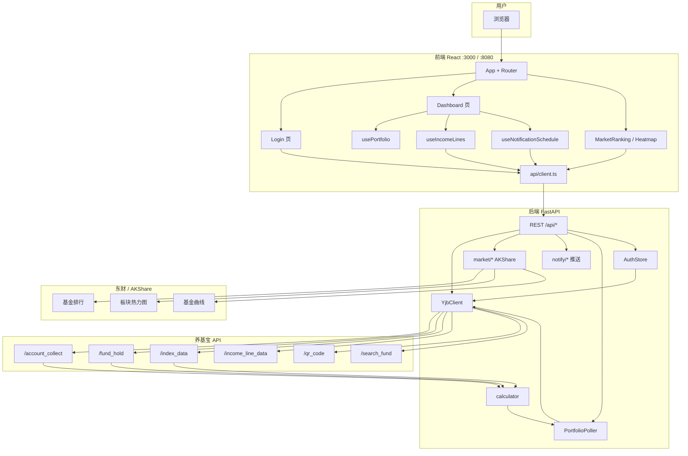
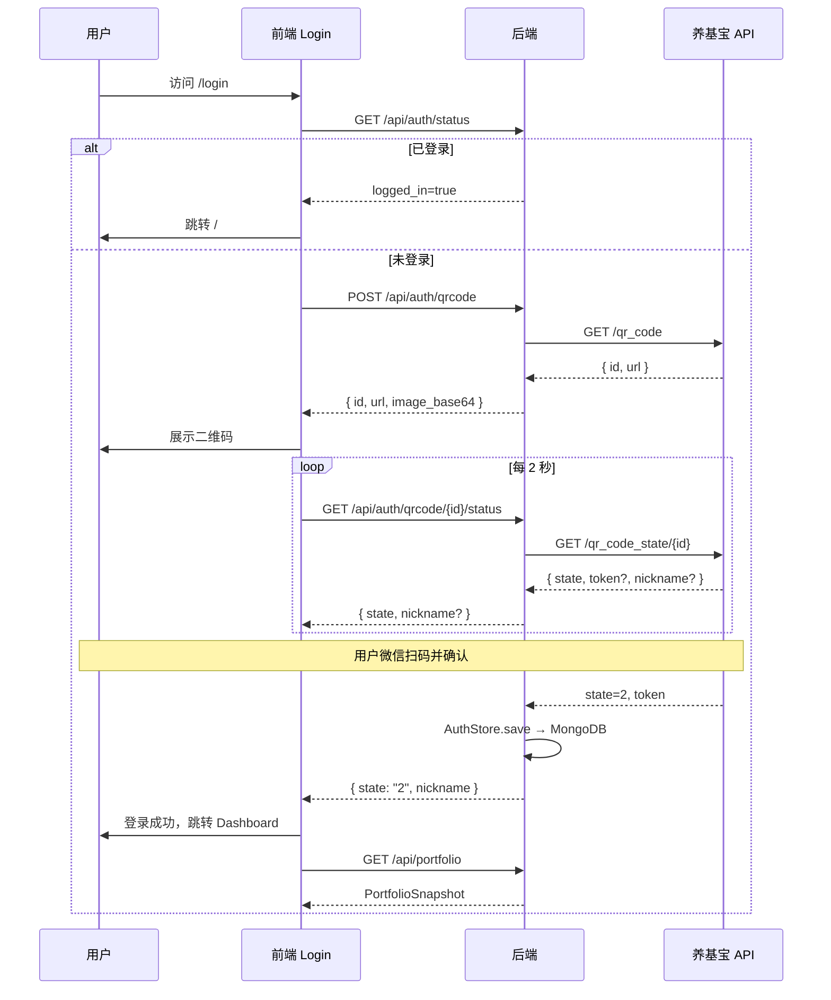
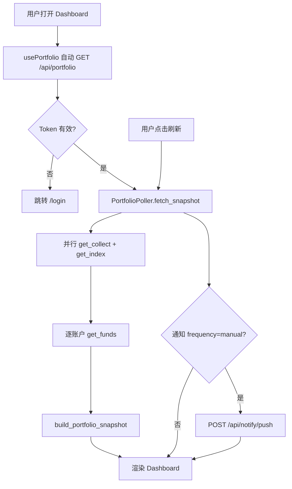
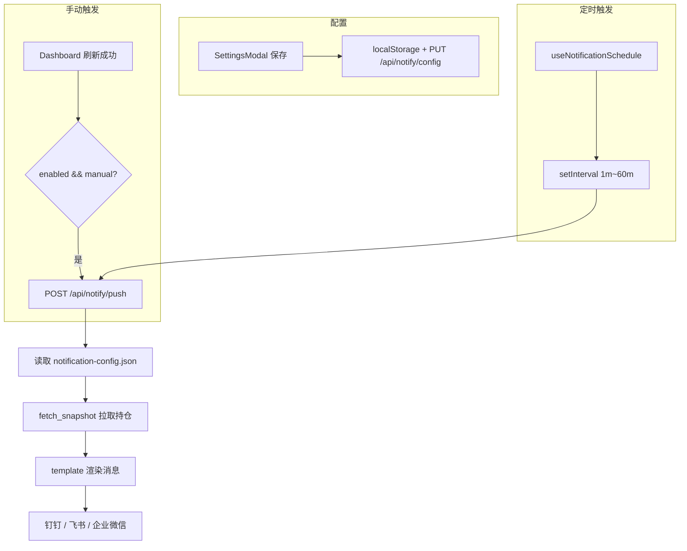
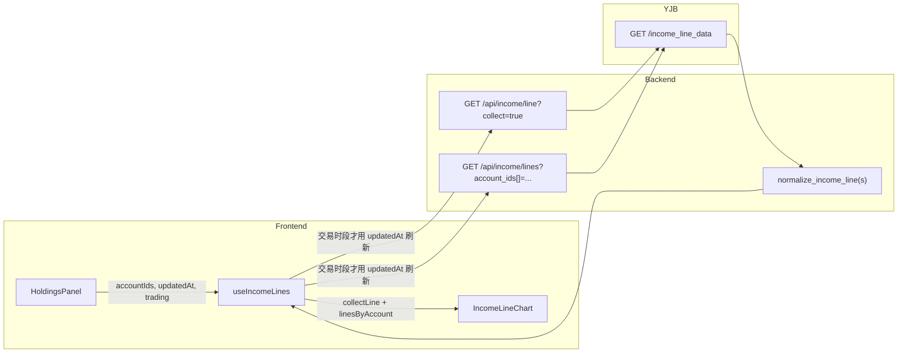
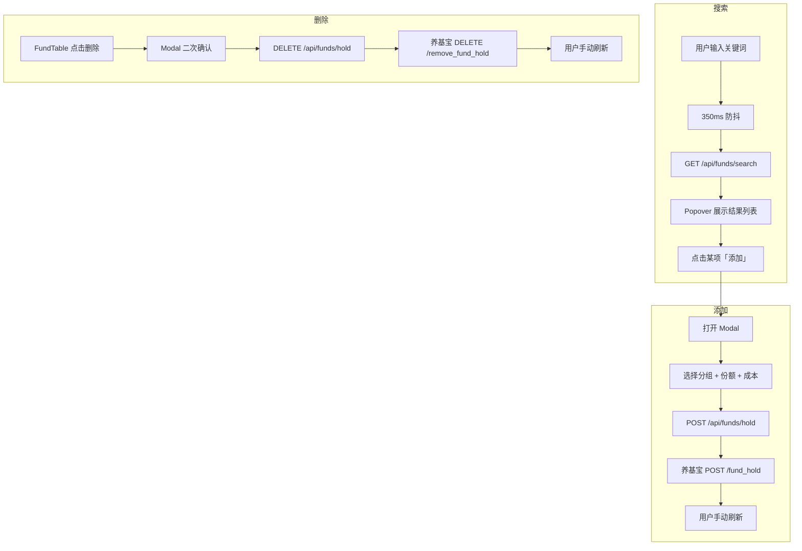
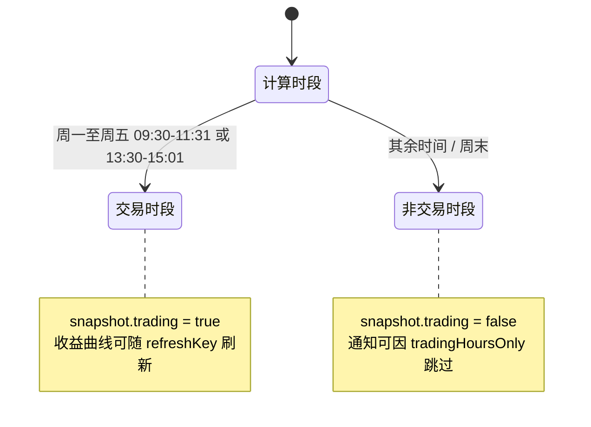

# Fund Helper — 技术文档 (TECH.md)

> **fund-helper**：基于养基宝 `browser-plug-api` 的基金收益实时监控面板。  
> 本文档描述项目架构、接口协议、功能模块、数据流与部署方式。上游养基宝原始 API 详见 [API_README.md](./API_README.md)。

---

## 目录

1. [项目概述](#1-项目概述)
2. [技术栈](#2-技术栈)
3. [系统架构](#3-系统架构)
4. [目录结构](#4-目录结构)
5. [后端架构](#5-后端架构)
6. [前端架构](#6-前端架构)
7. [功能模块](#7-功能模块)
8. [数据模型](#8-数据模型)
9. [本服务 API 文档](#9-本服务-api-文档)
10. [数据刷新与通知推送](#10-数据刷新与通知推送)
11. [养基宝与东财数据映射](#11-养基宝与东财数据映射)
12. [流程图](#12-流程图)
13. [配置与环境变量](#13-配置与环境变量)
14. [部署与启动](#14-部署与启动)
15. [错误处理与边界情况](#15-错误处理与边界情况)
16. [设计决策与已知限制](#16-设计决策与已知限制)

---

## 1. 项目概述

### 1.1 定位

本项目是一个 **BFF（Backend For Frontend）+ 实时监控面板**：

- **后端**：代理养基宝 browser-plug-api，统一管理 Token、MD5 签名、数据归一化；扩展 AKShare/东财市场数据；支持钉钉/飞书/企业微信通知推送；Docker 模式下托管前端静态资源。
- **前端**：React 单页应用，通过 REST 按需拉取持仓快照，提供市场排行、板块热力图、通知设置等页面。

### 1.2 核心能力

| 能力 | 说明 |
|------|------|
| 持仓监控 | 手动刷新拉取养基宝持仓，展示大盘指数与汇总卡片 |
| 多账户分组 | Tab 切换全部 / 支付宝 / 天天基金等分组 |
| 收益曲线 | 汇总 + 各分组独立曲线，自研 SVG 图表 |
| 基金管理 | 搜索、添加、删除持仓，可自定义表格列 |
| 市场排行 | 全市场基金多维度排行（AKShare / 东财），支持列配置与基金曲线弹窗 |
| 板块热力图 | 行业/概念板块涨幅或资金流向热力图，可下钻板块关联基金 |
| 通知推送 | 钉钉 / 飞书 / 企业微信，Webhook 或企业应用，定时或刷新后推送持仓收益 |
| 微信扫码登录 | 后端生成高清二维码，Token 持久化 |
| Docker 部署 | 单容器提供 API + 静态前端，数据卷持久化登录态与通知配置 |

### 1.3 服务端口

| 服务 | 默认端口 | 说明 |
|------|----------|------|
| FastAPI 后端 | `8000` | REST API（本地开发） |
| React 前端 | `3000` | 开发服务器，代理 `/api` |
| Docker 一体 | `8080` | API + 静态前端（`SERVE_STATIC=true`） |

---

## 2. 技术栈

| 层级 | 技术 | 版本/说明 |
|------|------|-----------|
| 后端运行时 | Python | 3.11+（兼容 3.9+） |
| 后端框架 | FastAPI | 异步 REST API |
| HTTP 客户端 | httpx | 异步请求养基宝 API |
| 配置 | pydantic-settings | 读取 `.env`，支持逗号分隔 CORS |
| 市场数据 | akshare | 东财 / 天天基金接口封装 |
| 二维码 | qrcode + Pillow | 后端生成 PNG base64 |
| 前端框架 | React | 19 |
| 语言 | TypeScript | 严格类型 |
| 构建 | Rsbuild | 替代 CRA/Vite |
| UI | Ant Design | 6.x，中文 locale |
| 路由 | react-router-dom | 7.x |
| 样式 | Sass + 内联 style | 无 CSS Modules |
| 代码规范 | Biome | lint + format |

---

## 3. 系统架构

### 3.1 三层架构

```
┌─────────────────────────────────────────────────────────────────┐
│                        用户浏览器 (:3000 / :8080)                │
│  React SPA ── REST (/api/*)                                     │
└────────────────────────────┬────────────────────────────────────┘
                             │ dev proxy / Docker 同域 / Nginx 反代
┌────────────────────────────▼────────────────────────────────────┐
│                   FastAPI BFF 服务 (:8000 / :8080)               │
│  ┌──────────┐  ┌──────────┐  ┌──────────┐  ┌─────────────────┐ │
│  │ REST API │  │  Market  │  │  Notify  │  │   AuthStore     │ │
│  │ routes   │  │ AKShare  │  │ 推送服务  │  │   MongoDB       │ │
│  └────┬─────┘  └────┬─────┘  └────┬─────┘  └─────────────────┘ │
│       │             │             │                              │
│       └─────────────┴──────┬──────┘                              │
│                            ▼                                     │
│                    ┌──────────────┐                              │
│                    │  YjbClient   │  MD5 签名 + Authorization   │
│                    │  calculator  │  数据归一化 / 收益计算        │
│                    │  Poller      │  按需拉取持仓快照             │
│                    └──────┬───────┘                              │
└───────────────────────────┼──────────────────────────────────────┘
                            │ HTTPS
        ┌───────────────────┴───────────────────┐
        ▼                                       ▼
┌───────────────────────┐           ┌──────────────────────────────┐
│ 养基宝 browser-plug-api │           │ 东方财富 / 天天基金 (东财)      │
│ account_collect ...   │           │ AKShare 拉取排行 / 热力图 / 曲线 │
└───────────────────────┘           └──────────────────────────────┘
```

### 3.2 数据流原则

1. **持仓主数据**：前端 `usePortfolio` → REST `GET /api/portfolio` → `PortfolioPoller.fetch_snapshot()` → 养基宝
2. **手动刷新**：Dashboard 刷新按钮 → 同上 → 可选触发通知推送
3. **收益曲线**：前端 `useIncomeLines` → REST `/api/income/*` → 养基宝（按需拉取）
4. **基金增删**：前端 REST → 养基宝 → 用户手动刷新更新快照
5. **市场数据**：市场排行 / 热力图 / 基金曲线 → REST `/api/market/*` → AKShare / 东财（与养基宝独立）
6. **通知推送**：设置页保存配置 → MongoDB `notification_configs` → 定时或刷新后 `POST /api/notify/push`
7. **登录**：扫码成功 → 创建用户与会话 → 设置 Cookie

### 3.3 组件依赖关系（后端）

```
main.py (lifespan)
  ├── auth/                  ← 多用户 Session Cookie
  ├── user_repo / session_repo
  └── PortfolioPoller        ← 按需拉取持仓快照（无后台轮询）
        ├── YjbClient        ← 养基宝 HTTP
        └── calculator       ← build_portfolio_snapshot / normalize_income_line

api/routes.py                ← REST 端点
market/*                     ← 排行 / 热力图 / 基金曲线（AKShare）
notify/*                     ← 配置持久化 / 连通性测试 / 推送
```

### 3.4 组件依赖关系（前端）

```
App.tsx
  ├── ConfigProvider (antd 主题)
  ├── ProtectedRoute   → api.getAuthStatus()
  ├── Login            → 扫码登录流程
  ├── Dashboard        → 持仓主页
  ├── MarketRanking    → /market 市场排行
  └── MarketHeatmap    → /market/heatmap 板块热力图

Dashboard
  ├── usePortfolio         → REST 持仓快照 + 手动刷新
  ├── useNotificationSchedule → 定时通知推送
  ├── IndexBar             ← portfolio.indices
  ├── SummaryCard × 4      ← portfolio 汇总字段
  ├── SettingsModal        → 通知渠道配置
  └── HoldingsPanel
        ├── useIncomeLines   → REST 收益曲线
        ├── FundSearch       → 搜索/添加
        ├── IncomeLineChart  → SVG 曲线
        ├── AccountSummaryCard
        └── FundTable        → 删除持仓、列配置
```

---

## 4. 目录结构

```
fund-helper/
├── TECH.md                 # 本文档
├── README.md               # 快速入门
├── API_README.md           # 养基宝上游 API 逆向文档
├── Dockerfile              # 多阶段构建（前端 + 后端）
├── docker-compose.yml      # 单容器部署
├── .env.docker.example     # Docker 环境变量示例
├── reset.sh                # 清除依赖与 Docker 卷
├── start.sh                # 一键启动脚本
│
├── backend/
│   ├── requirements.txt
│   ├── .env                # 可选环境变量
│   └── app/
│       ├── main.py         # FastAPI 入口、CORS、lifespan、SPA 静态托管
│       ├── config.py       # 配置项
│       ├── db/             # MongoDB 连接
│       │   ├── mongo.py
│       │   └── collections.py
│       ├── api/
│       │   └── routes.py   # REST API (/api)
│       ├── market/         # 市场数据（AKShare / 东财）
│       │   ├── network.py  # 东财直连、绕过系统代理
│       │   ├── fund_rank.py
│       │   ├── heatmap.py
│       │   ├── fund_curve.py
│       │   ├── sector_funds.py
│       │   ├── benchmark_curve.py
│       │   └── schemas.py
│       ├── notify/         # 通知推送
│       │   ├── config_store.py
│       │   ├── service.py
│       │   ├── template.py
│       │   ├── delivery.py
│       │   ├── delivery_catalog.py
│       │   └── feishu_group.py
│       ├── services/
│       │   └── poller.py   # 按需拉取持仓快照
│       └── yjb/
│           ├── client.py   # 养基宝 HTTP 客户端
│           ├── auth_store.py
│           └── calculator.py
│
└── frontend/
    ├── rsbuild.config.ts   # 构建 + dev 代理
    ├── package.json
    └── src/
        ├── index.tsx
        ├── App.tsx
        ├── api/client.ts   # REST 封装
        ├── hooks/
        │   ├── usePortfolio.ts
        │   ├── useIncomeLines.ts
        │   └── useNotificationSchedule.ts
        ├── types/
        │   ├── portfolio.ts
        │   └── market.ts
        ├── pages/
        │   ├── Dashboard/Dashboard.tsx
        │   ├── Login/Login.tsx
        │   ├── MarketRanking/MarketRanking.tsx
        │   └── MarketHeatmap/MarketHeatmap.tsx
        ├── components/
        │   ├── IndexBar/
        │   ├── SummaryCard/
        │   ├── HoldingsPanel/
        │   ├── AccountSummaryCard/
        │   ├── AccountIcon/
        │   ├── IncomeLineChart/
        │   ├── IncomeSparkline/
        │   ├── FundTable/
        │   ├── FundSearch/
        │   ├── FundCurveModal/
        │   ├── SectorFundsModal/
        │   ├── SeriesLineChart/
        │   └── SettingsModal/
        └── utils/
            ├── format.ts
            ├── incomeChart.ts
            ├── heatmap.ts
            ├── fundTableColumns.ts
            ├── marketRankColumns.ts
            ├── notificationSettings.ts
            ├── notificationPush.ts
            └── notificationConnectivity.ts
```

---

## 5. 后端架构

### 5.1 应用生命周期 (`main.py`)

```python
@asynccontextmanager
async def lifespan(app):
    auth_store = AuthStore()
    poller = PortfolioPoller(auth_store)

    app.state.auth_store = auth_store
    app.state.poller = poller
    app.state.notify_config_store = NotificationConfigStore()
    app.state.qr_sessions = {}

    yield
```

`SERVE_STATIC=true` 时，`_mount_frontend()` 挂载 `frontend/dist` 并提供 SPA fallback（`/api`、`/docs` 除外）。

### 5.2 YjbClient — 养基宝 HTTP 客户端

**签名算法**（与插件一致）：

```
Request-Sign = MD5(url_path + token + timestamp + API_SECRET)
```

**请求头**：

| Header | 值 |
|--------|-----|
| `Content-Type` | `application/json` |
| `Authorization` | 登录 token，未登录为空 |
| `Request-Time` | Unix 秒级时间戳 |
| `Request-Sign` | 32 位小写 MD5 hex |

**错误处理**：

- HTTP 401 或 body 含「token/登录/授权」→ `YjbApiError(status_code=401)`
- HTTP 429 → 请求频繁
- `code != 200` → 业务错误

### 5.3 认证与用户（MongoDB + Session Cookie）

**两层认证**：

1. **应用登录**：用户名 + 密码（bcrypt），Cookie `fund_helper_session`
2. **养基宝绑定**：持仓相关 API 需当前用户已绑定 `yjb_token`；未绑定或过期时返回 `yjb_not_bound` / `yjb_token_expired`，前端展示扫码绑定页

**集合**：

| 集合 | 说明 |
|------|------|
| `users` | 本地账号（`username` 唯一）+ 可选养基宝 Token / 昵称 / 头像 |
| `sessions` | 浏览器会话 |
| `notification_configs` | `_id` = `user_id` |

首次启动 `ensure_default_admin()` 创建管理员（`ADMIN_USERNAME` / `ADMIN_PASSWORD`，默认 `admin` / `123456`）。用户 CRUD 见 `/api/admin/users`。

### 5.4 PortfolioPoller — 按需拉取

> 无后台定时轮询、无 WebSocket。每次 `GET /api/portfolio` 或通知推送前实时请求养基宝。

**交易时段判断** `is_trading_hours()`：

| 条件 | 结果 |
|------|------|
| 周六、周日 | 非交易 |
| 09:30 – 11:31 | 交易 |
| 13:30 – 15:01 | 交易 |
| 其余时间 | 非交易 |

**`fetch_snapshot()` 拉取顺序**：

1. 并行：`get_collect()` + `get_index()`
2. 串行：对每个 `account_data[].account_id` 调用 `get_funds(account_id)`
3. `build_portfolio_snapshot()` 组装
4. 附加 `updated_at`、`user`、`trading`

### 5.5 Market — 市场数据模块

| 文件 | 职责 |
|------|------|
| `network.py` | 启动时 patch `requests` / AKShare，东财域名直连、绕过 Clash 等系统代理 |
| `fund_rank.py` | 全市场基金排行，多维度排序与分页 |
| `heatmap.py` | 行业/概念板块涨幅或资金流向热力图 |
| `fund_curve.py` | 单只基金累计收益 / 净值曲线 |
| `sector_funds.py` | 板块关联基金列表 |
| `benchmark_curve.py` | 板块 vs 上证 / 创业板指对比叠加 |

数据来源：AKShare 封装东方财富、天天基金公开接口，**不经过养基宝**。

### 5.6 Notify — 通知推送模块

| 文件 | 职责 |
|------|------|
| `config_store.py` | 读写 MongoDB `notification_configs` |
| `template.py` | 持仓收益文本 / 飞书交互卡片模板 |
| `service.py` | 连通性测试、多渠道推送（Webhook + 企业应用） |
| `delivery.py` | 解析钉钉 / 飞书 / 企业微信应用投递目标 |
| `delivery_catalog.py` | 拉取可投递会话列表 |
| `feishu_group.py` | 一键创建飞书通知群 |

**支持渠道**：

| 平台 | Webhook 群机器人 | 企业应用 |
|------|------------------|----------|
| 钉钉 | ✓ | ✓ |
| 飞书 | ✓ | ✓ |
| 企业微信 | ✓（key 参数） | ✓ |

### 5.7 Calculator — 数据归一化

| 函数 | 职责 |
|------|------|
| `calc_fund_day_earn()` | `money × gszzl / 100`，当日预估收益 |
| `enrich_fund()` | 标准化单只基金字段（含 nv_info、day_earn、day_rate） |
| `build_portfolio_snapshot()` | 组装 accounts / funds / indices 完整快照 |
| `_normalize_index_dir()` | 指数涨跌幅：用 `div` 符号校正 `dir` |
| `normalize_income_line()` | 收益曲线单条归一化 |
| `normalize_income_lines()` | 批量账户曲线归一化 |

**收益曲线重要逻辑**：

- 汇总：使用 `data.collect`
- 指定分组：使用 `data[str(account_id)]`，**不回退**到 collect（各分组曲线独立）

---

## 6. 前端架构

### 6.1 路由

| 路径 | 组件 | 守卫 |
|------|------|------|
| `/` | `Dashboard` | `ProtectedRoute` 需登录 |
| `/market` | `MarketRanking` | 需登录 |
| `/market/heatmap` | `MarketHeatmap` | 需登录 |
| `/login` | `Login` | 无 |
| `*` | 重定向到 `/` | — |

### 6.2 状态管理

**无 Redux/Zustand**，采用分层本地 state：

| 层级 | 位置 | 数据 |
|------|------|------|
| 持仓层 | `usePortfolio` | `portfolio`（Dashboard 主数据源） |
| 页面层 | `Dashboard` | 头像加载失败 flag、设置弹窗 |
| 页面层 | `Login` | 二维码、轮询状态 |
| 页面层 | `MarketRanking` / `MarketHeatmap` | 筛选条件、表格/热力图数据 |
| 组件层 | `HoldingsPanel` | `activeTab` |
| 组件层 | `FundSearch` | 关键词、结果、添加 Modal |
| 组件层 | `SettingsModal` | 通知渠道配置（localStorage + 服务端同步） |
| Hook 层 | `useIncomeLines` | 曲线数据、loading、error |
| Hook 层 | `useNotificationSchedule` | 定时推送 interval |

数据流：**REST → usePortfolio → Dashboard → props 下发子组件**。

### 6.3 自定义 Hooks

#### `usePortfolio`

- 挂载时 `GET /api/portfolio` 加载首屏
- `refresh()` 手动刷新，返回最新快照
- 401 时触发 `onAuthRequired` 跳转登录
- 返回 `{ portfolio, loading, refreshing, error, refresh }`

#### `useIncomeLines(accountIds, refreshKey?, trading?)`

- 并行请求：汇总曲线 `collect=true` + 各账户 `account_ids[]`
- **仅交易时段**将 `updatedAt` 作为 `refreshKey`，非交易时段只拉一次
- 返回 `{ collectLine, linesByAccount, loading, error }`

#### `useNotificationSchedule`

- 读取 `notificationSettings` 中的触发频次
- 支持 1m / 5m / 15m / 30m / 60m 定时调用 `POST /api/notify/push`
- 配置变更时监听 `fund-helper-notification-config-changed` 事件重建 interval

### 6.4 视觉规范

| 元素 | 值 |
|------|-----|
| 主色 / 涨 | `#fc4e50` |
| 跌 | `#07b360` |
| 平盘 / 次要文字 | `#8b95a8` |
| 页面背景 | `#f5f7fb` |
| 圆角 | `10px` |
| 数字字体 | `.mono` 等宽 |

`format.ts` 提供 `trendColor(value)`：正数红、负数绿、零灰。

### 6.5 开发代理 (`rsbuild.config.ts`)

```typescript
proxy: {
  '/api': { target: 'http://127.0.0.1:8000' },
}
```

Docker / 生产模式下前端与 API 同域，无需代理。

---

## 7. 功能模块

### 7.1 登录模块

| 环节 | 实现 |
|------|------|
| 二维码获取 | `POST /api/auth/qrcode` → 养基宝 `/qr_code` → 后端 qrcode 库生成 PNG base64 |
| 状态轮询 | 前端每 2s 调用 `GET /api/auth/qrcode/{id}/status` |
| 状态码 | `0` 等待 / `1` 已扫码 / `2` 成功 / `3` 失效 |
| Token 保存 | `state==2` 时 `AuthStore.save()` |
| 过期 | 前端 4 分钟超时，提示刷新 |
| 头像 | `GET /api/auth/avatar` 代理 CDN，避免浏览器跨域/直连失败 |

### 7.2 持仓监控模块

| 组件 | 数据源 | 展示内容 |
|------|--------|----------|
| `IndexBar` | `portfolio.indices` | 四大指数名称、点位、涨跌幅 |
| `SummaryCard` × 4 | `portfolio` 汇总字段 | 总资产、当日收益、净涨跌、账户数 |
| `HoldingsPanel` | `portfolio.accounts` | Tab 分组切换 |

Dashboard 右上角提供**刷新**按钮，调用 `usePortfolio.refresh()` 重新拉取养基宝数据；刷新成功后可按通知配置触发推送。

### 7.3 持仓面板模块 (`HoldingsPanel`)

**Tab「全部」**：

- `IncomeLineChart`：汇总当日收益曲线
- `AccountSummaryCard` 网格：各分组摘要 + `IncomeSparkline` 迷你曲线
- 点击卡片切换到对应账户 Tab

**Tab「单账户」**：

- `IncomeLineChart`：该分组独立曲线
- `FundTable`：基金明细表格

**Tab 栏右侧**：

- `FundSearch`（compact 模式）：搜索框 + Popover 结果列表

### 7.4 收益曲线模块

**后端拉取策略**（`YjbClient.get_income_line_data`）：

| 场景 | 养基宝参数 |
|------|------------|
| 汇总 | `date_type=day&collect=true` |
| 多分组 | `date_type=day&account_ids[]=id1&account_ids[]=id2` |

> 注意：文档写 `account_id + collect=false`，实测必须用 `account_ids[]` 才能拿到各分组独立曲线。

**前端图表**（`incomeChart.ts` + `IncomeLineChart`）：

- 自研 SVG，非 ECharts
- 时间轴按数据点 index 均匀映射（午休不留空）
- X 轴仅显示首末时间（如 09:30、15:00）
- 线条颜色由当日盈亏决定（`incomeTrendColor`）：盈红亏绿
- Hover 显示时间与收益率

### 7.5 基金管理模块

| 操作 | API | 后续 |
|------|-----|------|
| 搜索 | `GET /api/funds/search?keyword=` | 350ms 防抖，Popover 展示 |
| 添加 | `POST /api/funds/hold` | 选分组、填份额/成本 → 用户手动刷新 |
| 删除 | `DELETE /api/funds/hold` | Modal 二次确认 → 用户手动刷新 |

搜索支持：基金代码、名称、拼音简写、主题标签。

`FundTable` 与 `MarketRanking` 均支持**自定义可见列**，偏好保存在 localStorage（`fund-helper-fund-table-visible-columns`、`fund-helper-market-rank-visible-columns-v2`）。

### 7.6 市场排行模块 (`MarketRanking`)

- 路由：`/market`
- 数据源：`GET /api/market/rank`，筛选项来自 `/api/market/rank/options`
- 支持维度：当天 / 近 1 周~3 年 / 实时估计涨幅
- 支持范围：全部开放式 / 指数型；按基金类型、指数板块、主题板块筛选
- 点击基金名称打开 `FundCurveModal`，拉取 `/api/market/fund/{code}/curve`
- 列显示/排序偏好持久化到 localStorage

### 7.7 板块热力图模块 (`MarketHeatmap`)

- 路由：`/market/heatmap`
- 数据源：`GET /api/market/heatmap`
- 两种模式：`sector_change`（板块涨幅）、`fund_flow`（资金流向）
- 板块类型：行业 / 概念；资金流向指标：今日 / 5 日 / 10 日
- 点击板块格打开 `SectorFundsModal`，拉取 `/api/market/sector/funds`

### 7.8 通知推送模块 (`SettingsModal`)

**配置结构**（v1）：

```
NotificationConfig
├── enabled          总开关
├── trigger          frequency + tradingHoursOnly
└── channels
    └── dingtalk | feishu | wecom
        ├── webhook  群机器人 URL + 签名
        └── app      企业应用凭据 + 投递目标
```

**触发策略**：

| frequency | 行为 |
|-----------|------|
| `manual` | 仅手动刷新成功后推送 |
| `1m` ~ `60m` | 前端 `useNotificationSchedule` 定时调用 push |
| `daily_close` | 预留（每日收盘汇总） |

**持久化**：设置页保存时同步到 localStorage 与服务端 MongoDB（按 `user_id` 隔离）。

**推送内容**：持仓汇总、各账户收益、Top 涨跌基金；飞书支持交互卡片。

### 7.9 账户图标模块 (`AccountIcon`)

根据账户名称正则匹配平台图标：

| 匹配 | 字形 | 颜色 |
|------|------|------|
| 支付宝 | 支 | `#1677ff` |
| 天天/东方财富 | 天 | `#ff6a00` |
| 且慢/蛋卷 | 蛋 | `#faad14` |
| 微信 | 微 | `#07c160` |
| 银行 | 银 | `#64748b` |
| 默认 | 首字 | `#8b95a8` |

---

## 8. 数据模型

### 8.1 PortfolioSnapshot（持仓 API 响应主体）

```typescript
interface PortfolioSnapshot {
  total_assets: number;        // 总资产
  today_income: number;        // 当日总收益
  today_income_rate: number;   // 当日收益率 %
  rise_count: number;          // 上涨基金数（各账户 up 之和）
  fall_count: number;          // 下跌基金数
  accounts: AccountItem[];     // 分组列表
  funds: FundItem[];           // 全账户合并，按 |day_earn| 降序
  indices: IndexItem[];        // 四大指数
  updated_at?: string;         // ISO 时间，如 "2026-06-12T15:00:01"
  trading?: boolean;           // 是否交易时段
  user?: { nickname?: string; avatar?: string };
}
```

### 8.2 AccountItem

```typescript
interface AccountItem {
  account_id: number;
  title: string;               // 如「支付宝」「天天基金」
  today_income: number;
  today_income_rate: number;
  hold_income: number;         // 持有收益
  hold_income_rate: number;
  account_assets: number;
  up: number;                  // 该分组上涨基金数
  down: number;
  funds: FundItem[];
}
```

### 8.3 FundItem（核心字段）

```typescript
interface FundItem {
  id: number;                  // 持仓记录 ID（删除时用）
  fund_id: number;             // 基金 ID（添加时用）
  code: string;                // 如 "161725"
  short_name: string;
  money: number;               // 市值
  hold_share: number;          // 份额
  hold_cost: number;           // 成本
  hold_earn: number;           // 持有收益
  day_earn: number;            // 当日预估收益（后端计算）
  day_rate: number;            // 当日涨跌幅 %
  nv_info?: {
    dwjz: number;              // 单位净值
    gzjz: number;              // 估算净值
    gszzl: number;             // 估算涨跌幅 %
    jzzzl: number;             // 净值涨跌幅 %
    jzrq: string;              // 净值日期
    gztime: string;            // 估值时间
  };
  sector?: string;             // 板块
}
```

### 8.4 IncomeLineData

```typescript
interface IncomeLineData {
  account_id?: number;
  day: string;                 // 交易日，如 "2026-06-12"
  today_income: number;
  points: Array<{
    label: string;             // 时间，如 "09:35"
    rate: number;              // 累计收益率 %
  }>;
}
```

### 8.5 当日收益计算公式

```
day_earn = round(money × gszzl / 100, 2)
```

其中 `gszzl` 优先取 `nv_info.gszzl`，回退 `rzzl` / `zsgzzl`。

---

## 9. 本服务 API 文档

> Base URL：`http://localhost:8000`（开发环境经前端代理访问 `/api`）

### 9.1 健康检查

```
GET /api/health
```

**响应**：`{ "status": "ok" }`

---

### 9.2 认证

#### 获取登录状态

```
GET /api/auth/status
```

**响应**：

```json
{
  "logged_in": true,
  "nickname": "用户昵称",
  "avatar": "https://cdn.yangjibao.com/...",
  "login_time": "2026-06-12 10:30:00"
}
```

#### 获取用户头像（代理）

```
GET /api/auth/avatar
```

- 需登录且有 avatar
- 返回二进制图片，`Cache-Control: private, max-age=3600`
- 404：无头像；502：CDN 加载失败

#### 登出

```
POST /api/auth/logout
```

**响应**：`{ "ok": true }`  
**副作用**：清空 Token

#### 创建登录二维码

```
POST /api/auth/qrcode
```

**响应**：

```json
{
  "id": "qr_session_id",
  "url": "weixin://...",
  "image_base64": "iVBORw0KGgo..."
}
```

#### 轮询扫码状态

```
GET /api/auth/qrcode/{qr_id}/status
```

**响应**：

```json
{
  "state": "2",
  "nickname": "用户昵称",
  "avatar": "https://..."
}
```

| state | 含义 |
|-------|------|
| `0` | 等待扫码 |
| `1` | 已扫码，待确认 |
| `2` | 登录成功（后端自动保存 Token） |
| `3` | 二维码失效 |

---

### 9.3 持仓快照

#### 获取当前快照

```
GET /api/portfolio
```

- 实时拉取养基宝并组装 `PortfolioSnapshot`（需登录）
- 无服务端缓存，每次请求均访问上游

---

### 9.4 账户

```
GET /api/accounts
```

返回养基宝 `user_account` 原始 `data`（需登录）。

---

### 9.5 收益曲线

#### 单条曲线

```
GET /api/income/line?collect=true
GET /api/income/line?account_id={id}
GET /api/income/line?account_ids[]={id}
```

| 参数 | 说明 |
|------|------|
| `collect=true` | 汇总曲线 |
| `account_id` | 单分组（内部转为 account_ids） |
| `account_ids[]` | 多分组时取第一个 |

**响应**：`IncomeLineData`

#### 批量分组曲线

```
GET /api/income/lines?account_ids[]=1&account_ids[]=2
```

**响应**：

```json
{
  "1": { "account_id": 1, "day": "...", "today_income": 0, "points": [...] },
  "2": { "account_id": 2, "day": "...", "today_income": 0, "points": [...] }
}
```

---

### 9.6 基金搜索与持仓管理

#### 搜索基金

```
GET /api/funds/search?keyword=白酒&account_id=1
```

| 参数 | 必填 | 说明 |
|------|------|------|
| `keyword` | 是 | 代码/名称/拼音/主题 |
| `account_id` | 否 | 限定分组 |

**响应**：`SearchFundItem[]`（养基宝原始结构）

#### 添加持仓

```
POST /api/funds/hold
Content-Type: application/json
```

**请求体**：

```json
{
  "account_id": 1,
  "items": [
    {
      "fund_id": 12345,
      "fund_code": "161725",
      "hold_share": "100.0000",
      "hold_cost": "1.5000",
      "model": 1
    }
  ]
}
```

**响应**：`{ "ok": true, "data": ... }`

#### 删除持仓

```
DELETE /api/funds/hold?account_id=1&fund_ids[]=100&fund_ids[]=101
```

**响应**：`{ "ok": true, "data": ... }`

---

### 9.7 通知推送

#### 读取 / 保存配置

```
GET /api/notify/config
PUT /api/notify/config
```

持久化到 MongoDB `notification_configs` 集合，请求体/响应为 `{ "config": NotificationConfig | null }`。

#### 拉取投递目标

```
POST /api/notify/delivery-targets/{channel}
```

`channel`：`dingtalk` | `feishu` | `wecom`。根据企业应用凭据返回可投递群聊列表。

#### 创建飞书通知群

```
POST /api/notify/feishu/create-notification-group
```

为当前用户创建「你 + 机器人」专属群，返回 `chatId` 供应用 IM 投递。

#### 连通性测试

```
POST /api/notify/test
```

请求体：`{ "channel": "feishu", "config": NotificationConfig }`  
发送测试消息（含当前持仓快照，拉取失败则发占位文案）。

#### 推送持仓收益

```
POST /api/notify/push
```

按已保存配置向各启用渠道推送；响应 `status`：`success` | `partial` | `error` | `skipped`。

---

### 9.8 市场数据

#### 基金排行筛选项

```
GET /api/market/rank/options
```

#### 基金排行

```
GET /api/market/rank?dimension=day&scope=open&page=1&page_size=20
```

| 参数 | 说明 |
|------|------|
| `dimension` | `day` / `week1` / `month1` … / `estimate_rate` |
| `scope` | `open`（全部开放式）/ `index`（指数型） |
| `fund_type` | 基金类型，默认「全部」 |
| `board` | 指数板块 |
| `sector` | 主题板块 |
| `search` | 代码或名称关键词 |
| `order` | `asc` / `desc` |

#### 热力图

```
GET /api/market/heatmap/options
GET /api/market/heatmap?kind=sector_change&board_type=industry
```

| 参数 | 说明 |
|------|------|
| `kind` | `sector_change` / `fund_flow` |
| `board_type` | `industry` / `concept` |
| `indicator` | 资金流向时：`今日` / `5日` / `10日` |

#### 基金收益曲线

```
GET /api/market/fund/{code}/curve/options
GET /api/market/fund/{code}/curve?indicator=累计收益率走势&period=1年
```

#### 板块关联基金

```
GET /api/market/sector/funds?sector=白酒&board_type=industry&limit=50
```

#### 对比叠加曲线

```
GET /api/market/curve/overlays?period=1年&sector_name=白酒
```

返回板块、上证指数、创业板指同期走势，供 `SeriesLineChart` 对比展示。

---

### 9.9 通用错误码

| HTTP | 场景 |
|------|------|
| `401` | 未登录或 Token 失效（同时清空本地 Token） |
| `400` | 参数缺失（如 account_ids 为空） |
| `502` | 养基宝 API 调用失败 |

---

## 10. 数据刷新与通知推送

### 10.1 持仓数据拉取

本项目**不使用 WebSocket**，持仓数据由前端按需 REST 拉取：

| 时机 | 行为 |
|------|------|
| Dashboard 挂载 | `usePortfolio` 自动 `GET /api/portfolio` |
| 点击刷新 | 再次 `GET /api/portfolio`，全屏 loading |
| 增删基金后 | 需用户手动刷新 |

快照中的 `trading` 字段标识当前是否交易时段，供收益曲线与通知策略使用。

### 10.2 通知推送流程

```typescript
// 手动刷新后（frequency === 'manual'）
tryPushAfterRefresh({ trading: snapshot.trading })

// 定时推送（1m ~ 60m）
useNotificationSchedule → tryScheduledPush() → POST /api/notify/push
```

推送前若 `trigger.tradingHoursOnly === true` 且 `trading === false`，跳过推送。

### 10.3 401 与登录失效

- REST 返回 401 → 前端跳转 `/login`
- Poller 拉取时 401 → 清空 MongoDB 中的 auth 文档

---

## 11. 养基宝与东财数据映射

### 11.1 养基宝 API（持仓 / 登录）

| 养基宝 Path | 本服务封装 | 需 Token |
|-------------|------------|----------|
| `GET /qr_code` | `POST /api/auth/qrcode` | 否 |
| `GET /qr_code_state/{id}` | `GET /api/auth/qrcode/{id}/status` | 否 |
| `GET /user_account` | `GET /api/accounts` | 是 |
| `GET /account_collect` | `GET /api/portfolio` | 是 |
| `GET /fund_hold` | `GET /api/portfolio`（按 account_id） | 是 |
| `GET /index_data` | `GET /api/portfolio` | 是 |
| `GET /search_fund` | `GET /api/funds/search` | 是 |
| `POST /fund_hold` | `POST /api/funds/hold` | 是 |
| `DELETE /remove_fund_hold` | `DELETE /api/funds/hold` | 是 |
| `GET /income_line_data` | `GET /api/income/line` / `lines` | 是 |

详细字段说明见 [API_README.md](./API_README.md)。

### 11.2 东财 / AKShare（市场数据）

| 功能 | 本服务 API | 数据来源 |
|------|------------|----------|
| 基金排行 | `GET /api/market/rank` | AKShare → 东财开放式基金 |
| 板块热力图 | `GET /api/market/heatmap` | AKShare → 东财板块 |
| 基金曲线 | `GET /api/market/fund/{code}/curve` | 天天基金 / 东财 |
| 板块基金 | `GET /api/market/sector/funds` | 东财板块成分 |
| 对比曲线 | `GET /api/market/curve/overlays` | 板块 + 上证 + 创业板指 |

`market/network.py` 在 import 时配置东财域名直连，避免 Clash / Cursor 代理导致 `ProxyError`。

---

## 12. 流程图

### 12.1 整体系统流程图



### 12.2 微信扫码登录流程



### 12.3 持仓刷新流程



### 12.4 通知推送流程



### 12.5 收益曲线拉取流程



### 12.6 基金搜索 / 添加 / 删除流程



### 12.7 用户完整使用流程

```mermaid
flowchart TD
    A[打开应用] --> B{已登录?}
    B -->|否| C[/login 微信扫码]
    C --> D[轮询二维码状态]
    D --> E[登录成功]
    E --> F[Dashboard]
    B -->|是| F

    F --> G[GET /api/portfolio 加载持仓]
    G --> H[查看大盘指数 / 汇总 / 持仓面板]

    K --> L{操作}
    L --> M[切换账户 Tab]
    L --> N[查看收益曲线]
    L --> O[搜索基金并添加]
    L --> P[删除持仓]
    L --> Q[市场排行 / 板块热力图]
    L --> R[设置通知渠道]
    L --> S[手动刷新 + 可选推送]
    L --> T[退出登录]

    T --> U[POST /api/auth/logout]
    U --> V[跳转 /login]

    subgraph 认证失效
        W[Token 过期] --> X[API 401]
        X --> C
    end
```

### 12.8 交易时段标识



---

## 13. 配置与环境变量

配置文件：`backend/app/config.py`，通过 `pydantic-settings` 读取 `backend/.env`。

| 环境变量 | 默认值 | 说明 |
|----------|--------|------|
| `APP_NAME` | `Fund Helper` | FastAPI 标题 |
| `API_HOST` | `0.0.0.0` | 文档用途，实际由 uvicorn 参数指定 |
| `API_PORT` | `8000` | 监听端口（Docker 默认 `8080`） |
| `POLL_INTERVAL` | `30` | 保留配置项（当前无后台轮询） |
| `IDLE_CHECK_INTERVAL` | `60` | 保留配置项（当前无后台轮询） |
| `CORS_ORIGINS` | `["http://localhost:3000", ...]` | CORS 白名单；支持 JSON 数组或逗号分隔 |
| `PUBLIC_BASE_URL` | `http://localhost:8000` | OAuth 回调基址（飞书/钉钉应用后台需一致） |
| `FRONTEND_BASE_URL` | `http://localhost:3000` | 前端基址 |
| `SERVE_STATIC` | `false` | Docker 生产模式设为 `true`，后端托管前端 |
| `STATIC_DIR` | `<project>/frontend/dist` | 静态资源目录 |
| `YJB_BASE_URL` | `http://browser-plug-api.yangjibao.com` | 养基宝 API 地址 |
| `YJB_API_SECRET` | （内置） | MD5 签名密钥 |
| `MONGODB_URI` | `mongodb://localhost:27017` | MongoDB 连接串 |
| `MONGODB_DB` | `fund_helper` | 数据库名 |

**示例 `.env`（本地开发）**：

```env
CORS_ORIGINS=["http://localhost:3000","http://127.0.0.1:3000"]
PUBLIC_BASE_URL=http://localhost:8000
FRONTEND_BASE_URL=http://localhost:3000
```

**Docker 示例**见 [.env.docker.example](./.env.docker.example)。

---

## 14. 部署与启动

### 14.1 手动启动

**后端**：

```bash
cd backend
python3 -m venv .venv
source .venv/bin/activate
pip install -r requirements.txt
uvicorn app.main:app --reload --host 0.0.0.0 --port 8000
```

**前端**：

```bash
cd frontend
pnpm install
pnpm dev
```

浏览器访问：http://localhost:3000

### 14.2 一键启动

```bash
chmod +x start.sh
./start.sh          # 同时启动后端 + 前端
./start.sh backend  # 仅后端
./start.sh frontend # 仅前端
```

### 14.3 Docker 部署（推荐）

多阶段 `Dockerfile`：Node 构建前端 → Python 3.12 运行时。

```bash
docker compose up -d --build
docker compose ps
docker compose logs -f
```

| 项 | 值 |
|----|-----|
| 镜像 | `fund-helper:latest` |
| 容器 | `fund-helper` + `fund-helper-mongo` |
| 端口 | `8080`（API + 静态前端） |
| 数据卷 | `mongo_data`（MongoDB 持久化） |
| 健康检查 | `GET /api/health`（含 MongoDB ping） |

容器内默认 `SERVE_STATIC=true`，访问 http://localhost:8080 即可。登录态与通知配置保存在 MongoDB。

### 14.4 生产构建

```bash
cd frontend
pnpm build          # 产物在 frontend/dist/
```

生产环境需将 `dist/` 静态文件与 FastAPI 同域部署（或设置 `SERVE_STATIC=true`），配置 Nginx 反代 `/api` 到后端。

### 14.5 依赖清单

**后端** (`requirements.txt`)：fastapi, uvicorn, httpx, pydantic-settings, qrcode, pillow, motor, akshare

**前端** (`package.json`)：react, antd, react-router-dom, @rsbuild/*, sass

---

## 15. 错误处理与边界情况

| 场景 | 后端行为 | 前端行为 |
|------|----------|----------|
| Token 失效 | 删除 MongoDB auth 文档，返回 401 | 跳转 `/login` |
| 养基宝 429 | 返回 502「请求频繁」 | 显示错误 Alert |
| 养基宝网络失败 | REST 502 | 显示错误，可重试刷新 |
| 非交易时段 | 快照 `trading=false` | 收益曲线不重复刷新；通知可跳过 |
| 东财代理失败 | 市场 API 502 | 排行/热力图页显示错误 |
| 头像 CDN 失败 | `/api/auth/avatar` 502 | 回退显示昵称首字 Avatar |
| 二维码过期 | 养基宝 state=3 | 前端 4 分钟超时 + 刷新按钮 |
| 增删持仓后 | — | 需用户手动刷新 |
| 通知未配置 | push 返回 `skipped` | 设置页引导配置 |

---

## 16. 设计决策与已知限制

### 16.1 设计决策

| 决策 | 理由 |
|------|------|
| BFF 层代理养基宝 | 隐藏签名逻辑与 Token，统一数据格式 |
| REST 按需拉取 | 简化架构，避免 WebSocket 连接维护；用户可控刷新频率 |
| 市场数据独立模块 | AKShare/东财公开数据，与养基宝持仓解耦 |
| 通知配置双写 | localStorage 供前端定时器读取，服务端 JSON 供 push API 使用 |
| 东财直连 patch | 开发环境 Clash/Cursor 代理常导致 AKShare 失败 |
| 自研 SVG 曲线 | 轻量、可控，避免引入 ECharts 等大包 |
| 头像后端代理 | 养基宝 CDN 浏览器直连易失败 |
| Docker 单容器 | 降低部署门槛，静态资源由 FastAPI 托管 |
| `account_ids[]` 拉分组曲线 | 实测养基宝 `account_id+collect=false` 仍返回 collect |
| 无全局状态库 | 数据流简单，REST + 本地 state 足够 |

### 16.2 已知限制

1. **用户识别**：同一养基宝账号以「昵称 + 头像」hash 识别，极端情况下可能撞车。
2. **无自动刷新**：持仓不会后台定时更新，需手动刷新或重新进入页面。
3. **交易时段硬编码**：未对接养基宝节假日休市日历。
4. **收益曲线非实时**：由前端按需 REST 拉取。
5. **基金添加份额**：需用户手动填写，无自动同步券商持仓。
6. **市场数据依赖第三方**：AKShare/东财接口可能变更或限流。
7. **下午开盘时间**：本项目用 13:30，与 API 文档部分描述 13:00 略有差异。

### 16.3 相关文档

| 文档 | 内容 |
|------|------|
| [README.md](./README.md) | 快速入门、API 速查 |
| [API_README.md](./API_README.md) | 养基宝上游 API 完整逆向文档 |

---

*文档版本：2026-06-13 · 与项目代码同步*
