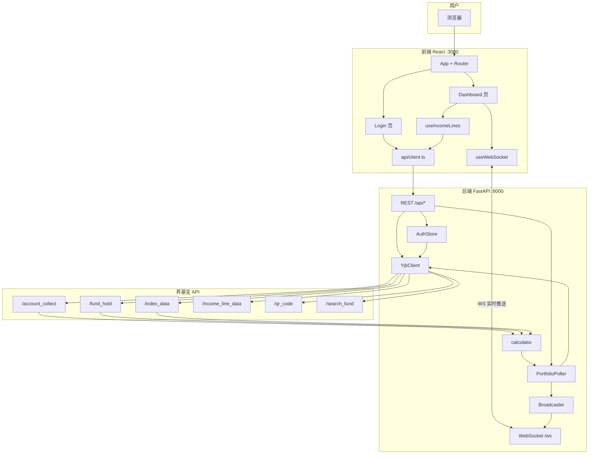
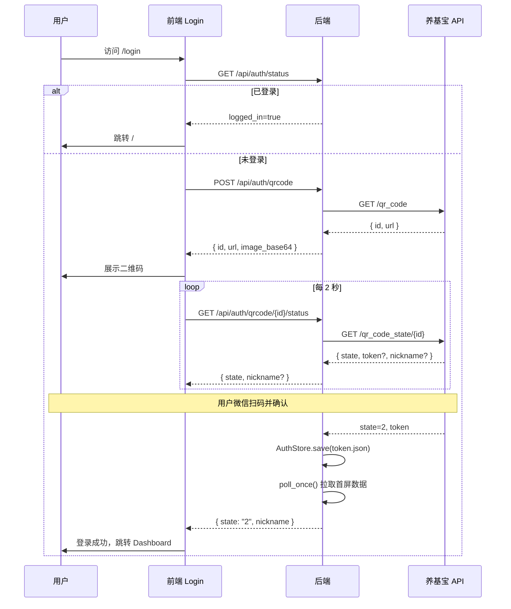
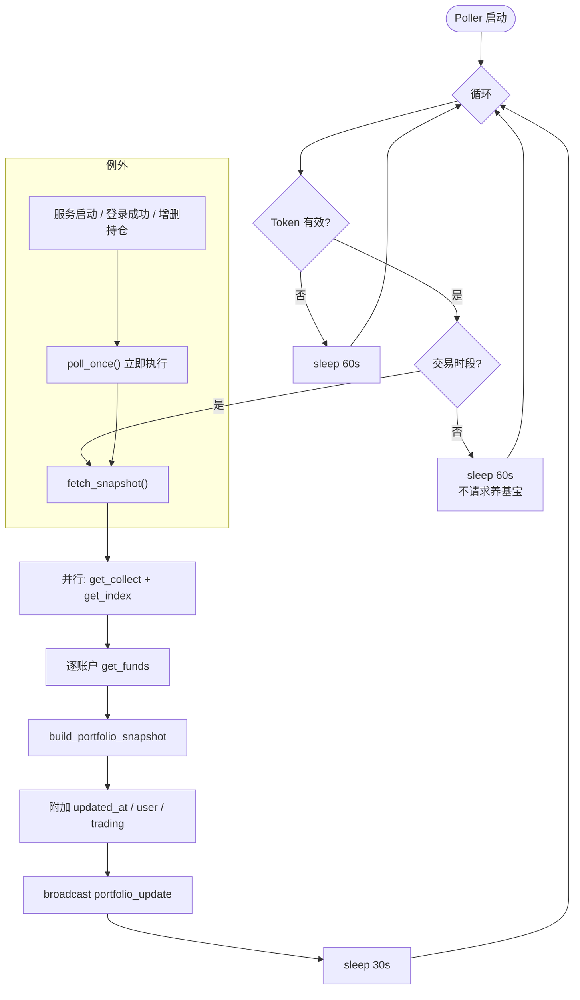
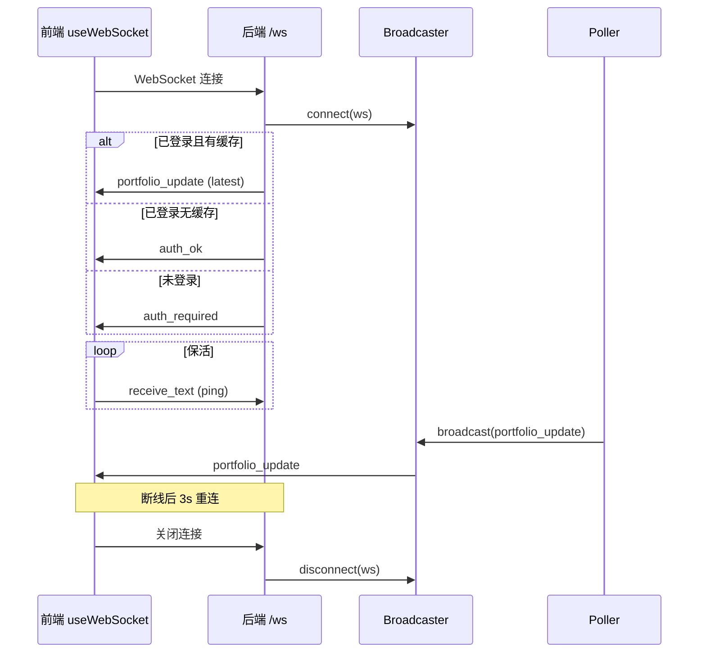
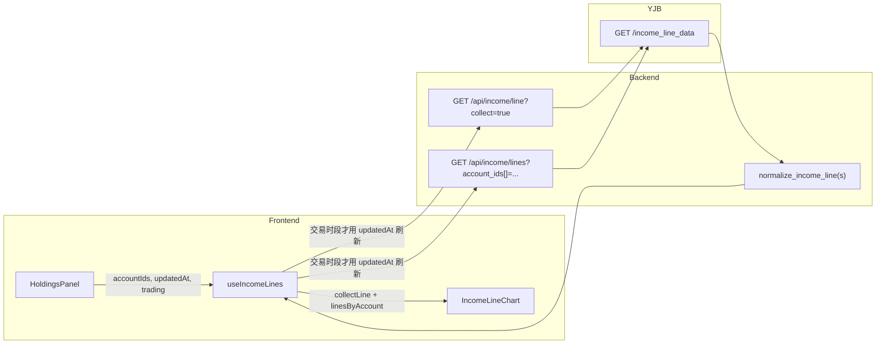
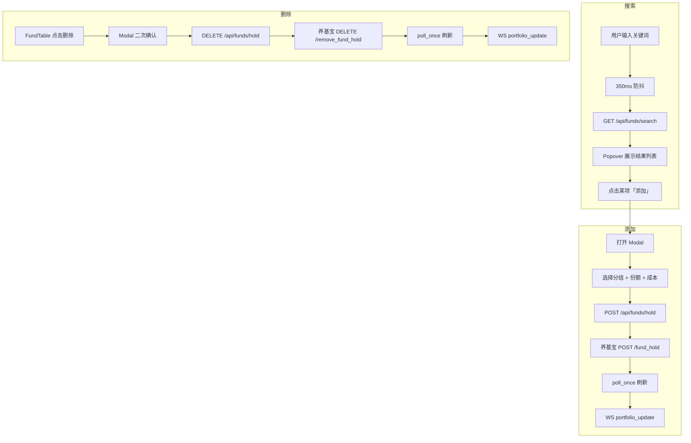
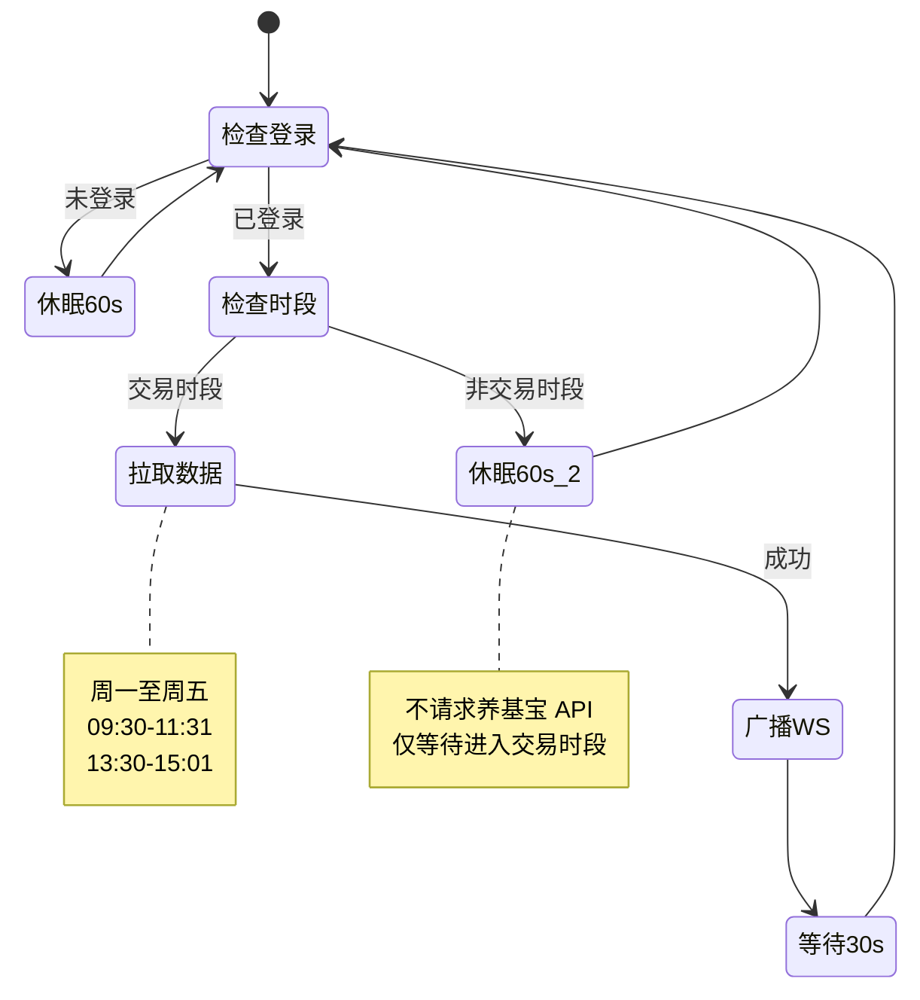

# 养基宝实时监控 — 技术文档 (TECH.md)

> **YJB Realtime**：基于养基宝 `browser-plug-api` 的基金收益实时监控面板。  
> 本文档描述项目架构、接口协议、功能模块、数据流与部署方式。上游养基宝原始 API 详见 [API_README.md](./API_README.md)。

---

## 目录

1. [项目概述](#1-项目概述)
2. [技术栈](#2-技术栈)
3. [系统架构](#3-系统架构)
4. [目录结构](#4-目录结构)
5. [后端架构](#5-后端架构)
6. [前端架构](#6-前端架构)
7. [功能模块](#7-功能模块)
8. [数据模型](#8-数据模型)
9. [本服务 API 文档](#9-本服务-api-文档)
10. [WebSocket 协议](#10-websocket-协议)
11. [养基宝上游 API 映射](#11-养基宝上游-api-映射)
12. [流程图](#12-流程图)
13. [配置与环境变量](#13-配置与环境变量)
14. [部署与启动](#14-部署与启动)
15. [错误处理与边界情况](#15-错误处理与边界情况)
16. [设计决策与已知限制](#16-设计决策与已知限制)

---

## 1. 项目概述

### 1.1 定位

本项目是一个 **BFF（Backend For Frontend）+ 实时监控面板**：

- **后端**：代理养基宝 browser-plug-api，统一管理 Token、MD5 签名、数据归一化、交易时段节流、WebSocket 推送。
- **前端**：React 单页应用，通过 WebSocket 接收持仓快照，通过 REST 处理登录、收益曲线、基金增删。

### 1.2 核心能力

| 能力 | 说明 |
|------|------|
| 实时持仓推送 | 交易时段每 30s 拉取养基宝数据，经 WebSocket 广播 |
| 大盘指数 | 上证、沪深300、深证成指、创业板指，涨红跌绿 |
| 多账户分组 | Tab 切换全部 / 支付宝 / 天天基金等分组 |
| 收益曲线 | 汇总 + 各分组独立曲线，自研 SVG 图表 |
| 基金管理 | 搜索、添加、删除持仓 |
| 微信扫码登录 | 后端生成高清二维码，Token 持久化 |
| 交易时段优化 | 非交易时段不请求养基宝 API，降低无效轮询 |

### 1.3 服务端口

| 服务 | 默认端口 | 说明 |
|------|----------|------|
| FastAPI 后端 | `8000` | REST + WebSocket |
| React 前端 | `3000` | 开发服务器，代理 `/api` 与 `/ws` |

---

## 2. 技术栈

| 层级 | 技术 | 版本/说明 |
|------|------|-----------|
| 后端运行时 | Python | 3.11+（兼容 3.9+） |
| 后端框架 | FastAPI | 异步 REST + WebSocket |
| HTTP 客户端 | httpx | 异步请求养基宝 API |
| 配置 | pydantic-settings | 读取 `.env` |
| 二维码 | qrcode + Pillow | 后端生成 PNG base64 |
| 前端框架 | React | 19 |
| 语言 | TypeScript | 严格类型 |
| 构建 | Rsbuild | 替代 CRA/Vite |
| UI | Ant Design | 6.x，中文 locale |
| 路由 | react-router-dom | 7.x |
| 样式 | Sass + 内联 style | 无 CSS Modules |
| 代码规范 | Biome | lint + format |

---

## 3. 系统架构

### 3.1 三层架构

```
┌─────────────────────────────────────────────────────────────────┐
│                        用户浏览器 (:3000)                        │
│  React SPA ── REST (/api/*) ── WebSocket (/ws)                  │
└────────────────────────────┬────────────────────────────────────┘
                             │ dev proxy / 生产反代
┌────────────────────────────▼────────────────────────────────────┐
│                   FastAPI BFF 服务 (:8000)                       │
│  ┌──────────┐  ┌──────────┐  ┌──────────┐  ┌─────────────────┐ │
│  │ REST API │  │ WebSocket│  │  Poller  │  │   AuthStore     │ │
│  │ routes   │  │broadcast │  │ 30s/idle │  │  token.json     │ │
│  └────┬─────┘  └────┬─────┘  └────┬─────┘  └─────────────────┘ │
│       │             │             │                              │
│       └─────────────┴──────┬──────┘                              │
│                            ▼                                     │
│                    ┌──────────────┐                              │
│                    │  YjbClient   │  MD5 签名 + Authorization   │
│                    │  calculator  │  数据归一化 / 收益计算        │
│                    └──────┬───────┘                              │
└───────────────────────────┼──────────────────────────────────────┘
                            │ HTTPS
┌───────────────────────────▼──────────────────────────────────────┐
│           养基宝 browser-plug-api (yangjibao.com)                 │
│  /account_collect  /fund_hold  /income_line_data  /qr_code ...  │
└──────────────────────────────────────────────────────────────────┘
```

### 3.2 数据流原则

1. **持仓主数据**：Poller → WebSocket → `useWebSocket` → Dashboard（推送驱动）
2. **收益曲线**：前端 `useIncomeLines` → REST `/api/income/*` → 养基宝（按需拉取）
3. **基金增删**：前端 REST → 养基宝 → 后端触发 `poll_once()` 刷新快照
4. **登录**：前端轮询 REST → 养基宝扫码 → `AuthStore.save()` → WebSocket `auth_ok`

### 3.3 组件依赖关系（后端）

```
main.py (lifespan)
  ├── AuthStore          ← token.json 读写、legacy 迁移
  ├── Broadcaster        ← WebSocket 连接池
  └── PortfolioPoller    ← 定时拉取 + 广播
        ├── YjbClient    ← 养基宝 HTTP
        └── calculator   ← build_portfolio_snapshot / normalize_income_line

api/routes.py            ← REST 端点，复用 YjbClient + Poller
api/websocket.py         ← WS 连接，首条消息推送缓存或 auth 状态
```

### 3.4 组件依赖关系（前端）

```
App.tsx
  ├── ConfigProvider (antd 主题)
  ├── ProtectedRoute   → api.getAuthStatus()
  ├── Login            → 扫码登录流程
  └── Dashboard
        ├── useWebSocket     → portfolio 实时数据
        ├── IndexBar           ← portfolio.indices
        ├── SummaryCard × 4    ← portfolio 汇总字段
        └── HoldingsPanel
              ├── useIncomeLines → REST 收益曲线
              ├── FundSearch       → 搜索/添加
              ├── IncomeLineChart  → SVG 曲线
              ├── AccountSummaryCard
              └── FundTable        → 删除持仓
```

---

## 4. 目录结构

```
yjb-realtime/
├── TECH.md                 # 本文档
├── README.md               # 快速入门
├── API_README.md           # 养基宝上游 API 逆向文档
├── start.sh                # 一键启动脚本
├── data/                   # 运行时数据（自动生成）
│   └── token.json          # 登录 Token 持久化
│
├── backend/
│   ├── requirements.txt
│   ├── .env                # 可选环境变量
│   └── app/
│       ├── main.py         # FastAPI 入口、CORS、lifespan
│       ├── config.py       # 配置项
│       ├── api/
│       │   ├── routes.py   # REST API (/api)
│       │   └── websocket.py# WebSocket (/ws)
│       ├── services/
│       │   ├── poller.py   # 定时轮询
│       │   └── broadcaster.py # WS 广播
│       └── yjb/
│           ├── client.py   # 养基宝 HTTP 客户端
│           ├── auth_store.py # Token 存储
│           └── calculator.py # 数据计算与归一化
│
└── frontend/
    ├── rsbuild.config.ts   # 构建 + dev 代理
    ├── package.json
    └── src/
        ├── index.tsx
        ├── App.tsx
        ├── api/client.ts   # REST 封装
        ├── hooks/
        │   ├── useWebSocket.ts
        │   └── useIncomeLines.ts
        ├── types/portfolio.ts
        ├── pages/
        │   ├── Dashboard/Dashboard.tsx
        │   └── Login/Login.tsx
        ├── components/
        │   ├── IndexBar/
        │   ├── SummaryCard/
        │   ├── HoldingsPanel/
        │   ├── AccountSummaryCard/
        │   ├── AccountIcon/
        │   ├── IncomeLineChart/
        │   ├── IncomeSparkline/
        │   ├── FundTable/
        │   └── FundSearch/
        ├── utils/
        │   ├── format.ts       # 金额/百分比/涨跌色
        │   └── incomeChart.ts  # SVG 曲线算法
        └── styles/global.scss
```

---

## 5. 后端架构

### 5.1 应用生命周期 (`main.py`)

```python
@asynccontextmanager
async def lifespan(app):
    auth_store = AuthStore()
    broadcaster = Broadcaster()
    poller = PortfolioPoller(auth_store, broadcaster)
    app.state.auth_store = auth_store
    app.state.broadcaster = broadcaster
    app.state.poller = poller
    app.state.qr_sessions = {}

    poller.start()                          # 启动后台轮询循环
    if auth_store.session.is_valid:
        asyncio.create_task(poller.poll_once())  # 有 Token 则立即拉一次

    yield
    poller.stop()
```

启动时若本地已有有效 Token，会**立即执行一次** `poll_once()`，保证 Dashboard 首屏有数据（不受交易时段限制）。

### 5.2 YjbClient — 养基宝 HTTP 客户端

**签名算法**（与插件一致）：

```
Request-Sign = MD5(url_path + token + timestamp + API_SECRET)
```

**请求头**：

| Header | 值 |
|--------|-----|
| `Content-Type` | `application/json` |
| `Authorization` | 登录 token，未登录为空 |
| `Request-Time` | Unix 秒级时间戳 |
| `Request-Sign` | 32 位小写 MD5 hex |

**错误处理**：

- HTTP 401 或 body 含「token/登录/授权」→ `YjbApiError(status_code=401)`
- HTTP 429 → 请求频繁
- `code != 200` → 业务错误

### 5.3 AuthStore — Token 持久化

| 方法 | 说明 |
|------|------|
| `session` | 当前 `AuthSession`（token/nickname/avatar/login_time） |
| `save()` | 登录成功后写入 `data/token.json` |
| `clear()` | 登出/失效时删除文件 |
| `_try_migrate_legacy_token()` | 自动从 `yjb-plugin-1.1.4/scripts/token.json` 迁移 |

**Token 文件格式**：

```json
{
  "token": "xxx",
  "nickname": "用户昵称",
  "avatar": "https://cdn.yangjibao.com/...",
  "login_time": "2026-06-12 10:30:00"
}
```

### 5.4 PortfolioPoller — 定时轮询

**交易时段判断** `is_trading_hours()`：

| 条件 | 结果 |
|------|------|
| 周六、周日 | 非交易 |
| 09:30 – 11:31 | 交易 |
| 13:30 – 15:01 | 交易 |
| 其余时间 | 非交易 |

**轮询循环逻辑**：

```
while True:
    if 未登录:
        sleep(idle_check_interval)  # 默认 60s
        continue
    if 交易时段:
        poll_once()
        sleep(poll_interval)        # 默认 30s
    else:
        sleep(idle_check_interval)    # 不请求养基宝，仅等待进入交易时段
```

**`fetch_snapshot()` 拉取顺序**：

1. 并行：`get_collect()` + `get_index()`
2. 串行：对每个 `account_data[].account_id` 调用 `get_funds(account_id)`
3. `build_portfolio_snapshot()` 组装
4. 附加 `updated_at`、`user`、`trading`

**`poll_once()` 广播**：

- 成功 → `{ type: "portfolio_update", data: snapshot }`
- 401 → 清空 Token → `{ type: "auth_required" }`
- 其他错误 → `{ type: "error", message }`

### 5.5 Broadcaster — WebSocket 广播

- 维护 `set[WebSocket]` 连接集合
- `broadcast(message)` 向所有连接发送 JSON，失败连接自动移除
- 使用 `asyncio.Lock` 保证并发安全

### 5.6 Calculator — 数据归一化

| 函数 | 职责 |
|------|------|
| `calc_fund_day_earn()` | `money × gszzl / 100`，当日预估收益 |
| `enrich_fund()` | 标准化单只基金字段（含 nv_info、day_earn、day_rate） |
| `build_portfolio_snapshot()` | 组装 accounts / funds / indices 完整快照 |
| `_normalize_index_dir()` | 指数涨跌幅：用 `div` 符号校正 `dir` |
| `normalize_income_line()` | 收益曲线单条归一化 |
| `normalize_income_lines()` | 批量账户曲线归一化 |

**收益曲线重要逻辑**：

- 汇总：使用 `data.collect`
- 指定分组：使用 `data[str(account_id)]`，**不回退**到 collect（各分组曲线独立）

---

## 6. 前端架构

### 6.1 路由

| 路径 | 组件 | 守卫 |
|------|------|------|
| `/` | `Dashboard` | `ProtectedRoute` 需登录 |
| `/login` | `Login` | 无 |
| `*` | 重定向到 `/` | — |

### 6.2 状态管理

**无 Redux/Zustand**，采用分层本地 state：

| 层级 | 位置 | 数据 |
|------|------|------|
| 实时层 | `useWebSocket` | `portfolio`（唯一全局数据源） |
| 页面层 | `Dashboard` | 头像加载失败 flag |
| 页面层 | `Login` | 二维码、轮询状态 |
| 组件层 | `HoldingsPanel` | `activeTab` |
| 组件层 | `FundSearch` | 关键词、结果、添加 Modal |
| Hook 层 | `useIncomeLines` | 曲线数据、loading、error |

数据流：**WebSocket → Dashboard → props 下发子组件**。

### 6.3 自定义 Hooks

#### `useWebSocket`

- 连接 `ws(s)://host/ws`
- 断线 3 秒自动重连
- 消息分发：`portfolio_update` / `auth_required` / `auth_ok` / `error`
- 返回 `{ connected, portfolio, error }`

#### `useIncomeLines(accountIds, refreshKey?, trading?)`

- 并行请求：汇总曲线 `collect=true` + 各账户 `account_ids[]`
- **仅交易时段**将 `updatedAt` 作为 `refreshKey`，非交易时段只拉一次
- 返回 `{ collectLine, linesByAccount, loading, error }`

### 6.4 视觉规范

| 元素 | 值 |
|------|-----|
| 主色 / 涨 | `#fc4e50` |
| 跌 | `#07b360` |
| 平盘 / 次要文字 | `#8b95a8` |
| 页面背景 | `#f5f7fb` |
| 圆角 | `10px` |
| 数字字体 | `.mono` 等宽 |

`format.ts` 提供 `trendColor(value)`：正数红、负数绿、零灰。

### 6.5 开发代理 (`rsbuild.config.ts`)

```typescript
proxy: {
  '/api': { target: 'http://127.0.0.1:8000' },
  '/ws':   { target: 'ws://127.0.0.1:8000', ws: true },
}
```

---

## 7. 功能模块

### 7.1 登录模块

| 环节 | 实现 |
|------|------|
| 二维码获取 | `POST /api/auth/qrcode` → 养基宝 `/qr_code` → 后端 qrcode 库生成 PNG base64 |
| 状态轮询 | 前端每 2s 调用 `GET /api/auth/qrcode/{id}/status` |
| 状态码 | `0` 等待 / `1` 已扫码 / `2` 成功 / `3` 失效 |
| Token 保存 | `state==2` 时 `AuthStore.save()` + WS 广播 `auth_ok` + 触发 `poll_once()` |
| 过期 | 前端 4 分钟超时，提示刷新 |
| 头像 | `GET /api/auth/avatar` 代理 CDN，避免浏览器跨域/直连失败 |

### 7.2 实时监控模块

| 组件 | 数据源 | 展示内容 |
|------|--------|----------|
| `IndexBar` | `portfolio.indices` | 四大指数名称、点位、涨跌幅 |
| `SummaryCard` × 4 | `portfolio` 汇总字段 | 总资产、当日收益、净涨跌、账户数 |
| `HoldingsPanel` | `portfolio.accounts` | Tab 分组切换 |

### 7.3 持仓面板模块 (`HoldingsPanel`)

**Tab「全部」**：

- `IncomeLineChart`：汇总当日收益曲线
- `AccountSummaryCard` 网格：各分组摘要 + `IncomeSparkline` 迷你曲线
- 点击卡片切换到对应账户 Tab

**Tab「单账户」**：

- `IncomeLineChart`：该分组独立曲线
- `FundTable`：基金明细表格

**Tab 栏右侧**：

- `FundSearch`（compact 模式）：搜索框 + Popover 结果列表

### 7.4 收益曲线模块

**后端拉取策略**（`YjbClient.get_income_line_data`）：

| 场景 | 养基宝参数 |
|------|------------|
| 汇总 | `date_type=day&collect=true` |
| 多分组 | `date_type=day&account_ids[]=id1&account_ids[]=id2` |

> 注意：文档写 `account_id + collect=false`，实测必须用 `account_ids[]` 才能拿到各分组独立曲线。

**前端图表**（`incomeChart.ts` + `IncomeLineChart`）：

- 自研 SVG，非 ECharts
- 时间轴按数据点 index 均匀映射（午休不留空）
- X 轴仅显示首末时间（如 09:30、15:00）
- 线条颜色由当日盈亏决定（`incomeTrendColor`）：盈红亏绿
- Hover 显示时间与收益率

### 7.5 基金管理模块

| 操作 | API | 后续 |
|------|-----|------|
| 搜索 | `GET /api/funds/search?keyword=` | 350ms 防抖，Popover 展示 |
| 添加 | `POST /api/funds/hold` | 选分组、填份额/成本 → 触发 `poll_once()` |
| 删除 | `DELETE /api/funds/hold` | Modal 二次确认 → 触发 `poll_once()` |

搜索支持：基金代码、名称、拼音简写、主题标签。

### 7.6 账户图标模块 (`AccountIcon`)

根据账户名称正则匹配平台图标：

| 匹配 | 字形 | 颜色 |
|------|------|------|
| 支付宝 | 支 | `#1677ff` |
| 天天/东方财富 | 天 | `#ff6a00` |
| 且慢/蛋卷 | 蛋 | `#faad14` |
| 微信 | 微 | `#07c160` |
| 银行 | 银 | `#64748b` |
| 默认 | 首字 | `#8b95a8` |

---

## 8. 数据模型

### 8.1 PortfolioSnapshot（WebSocket 推送主体）

```typescript
interface PortfolioSnapshot {
  total_assets: number;        // 总资产
  today_income: number;        // 当日总收益
  today_income_rate: number;   // 当日收益率 %
  rise_count: number;          // 上涨基金数（各账户 up 之和）
  fall_count: number;          // 下跌基金数
  accounts: AccountItem[];     // 分组列表
  funds: FundItem[];           // 全账户合并，按 |day_earn| 降序
  indices: IndexItem[];        // 四大指数
  updated_at?: string;         // ISO 时间，如 "2026-06-12T15:00:01"
  trading?: boolean;           // 是否交易时段
  user?: { nickname?: string; avatar?: string };
}
```

### 8.2 AccountItem

```typescript
interface AccountItem {
  account_id: number;
  title: string;               // 如「支付宝」「天天基金」
  today_income: number;
  today_income_rate: number;
  hold_income: number;         // 持有收益
  hold_income_rate: number;
  account_assets: number;
  up: number;                  // 该分组上涨基金数
  down: number;
  funds: FundItem[];
}
```

### 8.3 FundItem（核心字段）

```typescript
interface FundItem {
  id: number;                  // 持仓记录 ID（删除时用）
  fund_id: number;             // 基金 ID（添加时用）
  code: string;                // 如 "161725"
  short_name: string;
  money: number;               // 市值
  hold_share: number;          // 份额
  hold_cost: number;           // 成本
  hold_earn: number;           // 持有收益
  day_earn: number;            // 当日预估收益（后端计算）
  day_rate: number;            // 当日涨跌幅 %
  nv_info?: {
    dwjz: number;              // 单位净值
    gzjz: number;              // 估算净值
    gszzl: number;             // 估算涨跌幅 %
    jzzzl: number;             // 净值涨跌幅 %
    jzrq: string;              // 净值日期
    gztime: string;            // 估值时间
  };
  sector?: string;             // 板块
}
```

### 8.4 IncomeLineData

```typescript
interface IncomeLineData {
  account_id?: number;
  day: string;                 // 交易日，如 "2026-06-12"
  today_income: number;
  points: Array<{
    label: string;             // 时间，如 "09:35"
    rate: number;              // 累计收益率 %
  }>;
}
```

### 8.5 当日收益计算公式

```
day_earn = round(money × gszzl / 100, 2)
```

其中 `gszzl` 优先取 `nv_info.gszzl`，回退 `rzzl` / `zsgzzl`。

---

## 9. 本服务 API 文档

> Base URL：`http://localhost:8000`（开发环境经前端代理访问 `/api`）

### 9.1 健康检查

```
GET /api/health
```

**响应**：`{ "status": "ok" }`

---

### 9.2 认证

#### 获取登录状态

```
GET /api/auth/status
```

**响应**：

```json
{
  "logged_in": true,
  "nickname": "用户昵称",
  "avatar": "https://cdn.yangjibao.com/...",
  "login_time": "2026-06-12 10:30:00"
}
```

#### 获取用户头像（代理）

```
GET /api/auth/avatar
```

- 需登录且有 avatar
- 返回二进制图片，`Cache-Control: private, max-age=3600`
- 404：无头像；502：CDN 加载失败

#### 登出

```
POST /api/auth/logout
```

**响应**：`{ "ok": true }`  
**副作用**：清空 Token，WebSocket 广播 `auth_required`

#### 创建登录二维码

```
POST /api/auth/qrcode
```

**响应**：

```json
{
  "id": "qr_session_id",
  "url": "weixin://...",
  "image_base64": "iVBORw0KGgo..."
}
```

#### 轮询扫码状态

```
GET /api/auth/qrcode/{qr_id}/status
```

**响应**：

```json
{
  "state": "2",
  "nickname": "用户昵称",
  "avatar": "https://..."
}
```

| state | 含义 |
|-------|------|
| `0` | 等待扫码 |
| `1` | 已扫码，待确认 |
| `2` | 登录成功（后端自动保存 Token） |
| `3` | 二维码失效 |

---

### 9.3 持仓快照

#### 获取当前快照

```
GET /api/portfolio
```

- 优先返回 Poller 缓存 `latest`
- 缓存为空时实时拉取养基宝（需登录）
- 响应体为 `PortfolioSnapshot`

---

### 9.4 账户

```
GET /api/accounts
```

返回养基宝 `user_account` 原始 `data`（需登录）。

---

### 9.5 收益曲线

#### 单条曲线

```
GET /api/income/line?collect=true
GET /api/income/line?account_id={id}
GET /api/income/line?account_ids[]={id}
```

| 参数 | 说明 |
|------|------|
| `collect=true` | 汇总曲线 |
| `account_id` | 单分组（内部转为 account_ids） |
| `account_ids[]` | 多分组时取第一个 |

**响应**：`IncomeLineData`

#### 批量分组曲线

```
GET /api/income/lines?account_ids[]=1&account_ids[]=2
```

**响应**：

```json
{
  "1": { "account_id": 1, "day": "...", "today_income": 0, "points": [...] },
  "2": { "account_id": 2, "day": "...", "today_income": 0, "points": [...] }
}
```

---

### 9.6 基金搜索与持仓管理

#### 搜索基金

```
GET /api/funds/search?keyword=白酒&account_id=1
```

| 参数 | 必填 | 说明 |
|------|------|------|
| `keyword` | 是 | 代码/名称/拼音/主题 |
| `account_id` | 否 | 限定分组 |

**响应**：`SearchFundItem[]`（养基宝原始结构）

#### 添加持仓

```
POST /api/funds/hold
Content-Type: application/json
```

**请求体**：

```json
{
  "account_id": 1,
  "items": [
    {
      "fund_id": 12345,
      "fund_code": "161725",
      "hold_share": "100.0000",
      "hold_cost": "1.5000",
      "model": 1
    }
  ]
}
```

**响应**：`{ "ok": true, "data": ... }`  
**副作用**：异步触发 `poll_once()` 刷新快照

#### 删除持仓

```
DELETE /api/funds/hold?account_id=1&fund_ids[]=100&fund_ids[]=101
```

**响应**：`{ "ok": true, "data": ... }`  
**副作用**：异步触发 `poll_once()` 刷新快照

---

### 9.7 通用错误码

| HTTP | 场景 |
|------|------|
| `401` | 未登录或 Token 失效（同时清空本地 Token） |
| `400` | 参数缺失（如 account_ids 为空） |
| `502` | 养基宝 API 调用失败 |

---

## 10. WebSocket 协议

### 10.1 连接

```
WS /ws
```

开发环境：`ws://localhost:3000/ws`（经 Rsbuild 代理到 8000）

### 10.2 连接建立 — 服务端首条消息

| 条件 | 首条消息 |
|------|----------|
| 已登录 + 有缓存快照 | `{ type: "portfolio_update", data: PortfolioSnapshot }` |
| 已登录 + 无缓存 | `{ type: "auth_ok", data: { nickname, avatar } }` |
| 未登录 | `{ type: "auth_required" }` |

### 10.3 消息类型

```typescript
type WsMessage =
  | { type: 'portfolio_update'; data: PortfolioSnapshot }
  | { type: 'auth_required' }
  | { type: 'auth_ok'; data: { nickname?: string; avatar?: string } }
  | { type: 'error'; message: string };
```

### 10.4 广播触发时机

| 事件 | 消息 |
|------|------|
| Poller `poll_once` 成功 | `portfolio_update` |
| 扫码登录成功 | `auth_ok`（REST 轮询路径） |
| 登出 / Token 失效 | `auth_required` |
| 拉取失败 | `error` |

### 10.5 客户端行为

- 连接后仅 `receive_text()` 保活，**不发送业务消息**
- 断线后 3 秒自动重连
- 收到 `auth_required` → 跳转 `/login`

---

## 11. 养基宝上游 API 映射

本服务作为 BFF，将以下养基宝接口封装为本地 API：

| 养基宝 Path | 本服务封装 | 需 Token |
|-------------|------------|----------|
| `GET /qr_code` | `POST /api/auth/qrcode` | 否 |
| `GET /qr_code_state/{id}` | `GET /api/auth/qrcode/{id}/status` | 否 |
| `GET /user_account` | `GET /api/accounts` | 是 |
| `GET /account_collect` | Poller / `GET /api/portfolio` | 是 |
| `GET /fund_hold` | Poller（按 account_id） | 是 |
| `GET /index_data` | Poller | 否 |
| `GET /search_fund` | `GET /api/funds/search` | 是 |
| `POST /fund_hold` | `POST /api/funds/hold` | 是 |
| `DELETE /remove_fund_hold` | `DELETE /api/funds/hold` | 是 |
| `GET /income_line_data` | `GET /api/income/line` / `lines` | 是 |

详细字段说明见 [API_README.md](./API_README.md)。

---

## 12. 流程图

### 12.1 整体系统流程图



### 12.2 微信扫码登录流程



### 12.3 实时数据轮询流程



### 12.4 WebSocket 生命周期



### 12.5 收益曲线拉取流程



### 12.6 基金搜索 / 添加 / 删除流程



### 12.7 用户完整使用流程

```mermaid
flowchart TD
    A[打开应用] --> B{已登录?}
    B -->|否| C[/login 微信扫码]
    C --> D[轮询二维码状态]
    D --> E[登录成功]
    E --> F[Dashboard]
    B -->|是| F

    F --> G[WebSocket 连接]
    G --> H[接收 portfolio_update]
    H --> I[查看大盘指数]
    H --> J[查看汇总卡片]
    H --> K[持仓面板]

    K --> L{操作}
    L --> M[切换账户 Tab]
    L --> N[查看收益曲线]
    L --> O[搜索基金并添加]
    L --> P[删除持仓]
    L --> Q[退出登录]

    Q --> R[POST /api/auth/logout]
    R --> S[跳转 /login]

    subgraph 认证失效
        T[Token 过期] --> U[WS auth_required 或 API 401]
        U --> C
    end
```

### 12.8 交易时段状态机



---

## 13. 配置与环境变量

配置文件：`backend/app/config.py`，通过 `pydantic-settings` 读取 `backend/.env`。

| 环境变量 | 默认值 | 说明 |
|----------|--------|------|
| `APP_NAME` | `YJB Realtime Monitor` | FastAPI 标题 |
| `API_HOST` | `0.0.0.0` | 文档用途，实际由 uvicorn 参数指定 |
| `API_PORT` | `8000` | 文档用途 |
| `POLL_INTERVAL` | `30` | 交易时段轮询间隔（秒） |
| `IDLE_CHECK_INTERVAL` | `60` | 非交易时段唤醒间隔（秒） |
| `CORS_ORIGINS` | `["http://localhost:3000", ...]` | CORS 白名单 |
| `YJB_BASE_URL` | `http://browser-plug-api.yangjibao.com` | 养基宝 API 地址 |
| `YJB_API_SECRET` | `YxmKSrQR4uoJ5lOoWIhcbd7SlUEh9OOc` | MD5 签名密钥 |
| `DATA_DIR` | `<project>/data` | Token 存储目录 |

**示例 `.env`**：

```env
POLL_INTERVAL=30
IDLE_CHECK_INTERVAL=60
CORS_ORIGINS=["http://localhost:3000","http://127.0.0.1:3000"]
```

---

## 14. 部署与启动

### 14.1 手动启动

**后端**：

```bash
cd backend
python3 -m venv .venv
source .venv/bin/activate
pip install -r requirements.txt
uvicorn app.main:app --reload --host 0.0.0.0 --port 8000
```

**前端**：

```bash
cd frontend
npm install
npm run dev
```

浏览器访问：http://localhost:3000

### 14.2 一键启动

```bash
chmod +x start.sh
./start.sh          # 同时启动后端 + 前端
./start.sh backend  # 仅后端
./start.sh frontend # 仅前端
```

### 14.3 生产构建

```bash
cd frontend
npm run build       # 产物在 frontend/dist/
```

生产环境需将 `dist/` 静态文件与 FastAPI 同域部署，或配置 Nginx 反代 `/api` 与 `/ws` 到后端。

### 14.4 依赖清单

**后端** (`requirements.txt`)：fastapi, uvicorn, httpx, pydantic-settings, qrcode, pillow

**前端** (`package.json`)：react, antd, react-router-dom, @rsbuild/*, sass

---

## 15. 错误处理与边界情况

| 场景 | 后端行为 | 前端行为 |
|------|----------|----------|
| Token 失效 | 清空 `token.json`，返回 401 或 WS `auth_required` | 跳转 `/login` |
| 养基宝 429 | 返回 502「请求频繁」 | 显示错误 Alert |
| 养基宝网络失败 | WS `error` 或 REST 502 | 显示错误，WS 3s 重连 |
| 非交易时段 | Poller 不拉取，快照 `trading=false` | 收益曲线不重复刷新 |
| 头像 CDN 失败 | `/api/auth/avatar` 502 | 回退显示昵称首字 Avatar |
| 二维码过期 | 养基宝 state=3 | 前端 4 分钟超时 + 刷新按钮 |
| WebSocket 断线 | — | 3 秒自动重连，Badge 显示「重连中」 |
| 增删持仓后 | 异步 `poll_once()` | 等待 WS 推送更新 |

---

## 16. 设计决策与已知限制

### 16.1 设计决策

| 决策 | 理由 |
|------|------|
| BFF 层代理养基宝 | 隐藏签名逻辑与 Token，统一数据格式，支持 WebSocket 推送 |
| WebSocket 推送 + REST 补充 | 持仓高频更新走 WS；曲线、搜索等低频走 REST |
| 交易时段节流 | 避免非交易时间无效 API 调用 |
| 自研 SVG 曲线 | 轻量、可控，避免引入 ECharts 等大包 |
| 头像后端代理 | 养基宝 CDN 浏览器直连易失败 |
| `account_ids[]` 拉分组曲线 | 实测养基宝 `account_id+collect=false` 仍返回 collect |
| 无全局状态库 | 数据流简单，WebSocket 单数据源足够 |

### 16.2 已知限制

1. **单用户**：Token 存本地文件，不支持多用户并发登录。
2. **交易时段硬编码**：未对接养基宝节假日休市日历。
3. **收益曲线非实时**：由前端按需 REST 拉取，非 WebSocket 推送。
4. **基金添加份额**：需用户手动填写，无自动同步券商持仓。
5. **API_SECRET 硬编码**：与插件相同，存于配置文件（养基宝公开密钥）。
6. **下午开盘时间**：本项目用 13:30，与 API 文档部分描述 13:00 略有差异。

### 16.3 相关文档

| 文档 | 内容 |
|------|------|
| [README.md](./README.md) | 快速入门、API 速查 |
| [API_README.md](./API_README.md) | 养基宝上游 API 完整逆向文档 |

---

*文档版本：2026-06-12 · 与项目代码同步*
