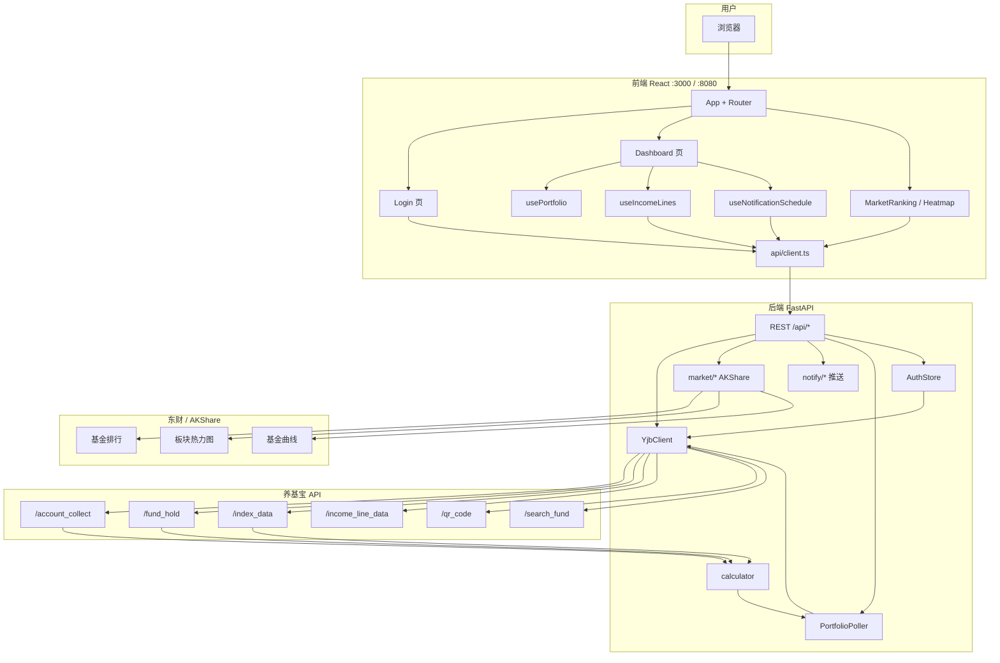
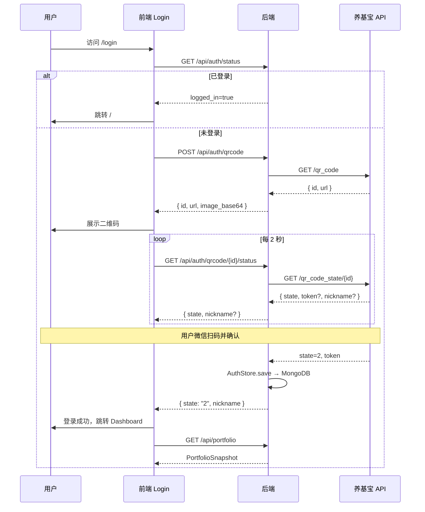
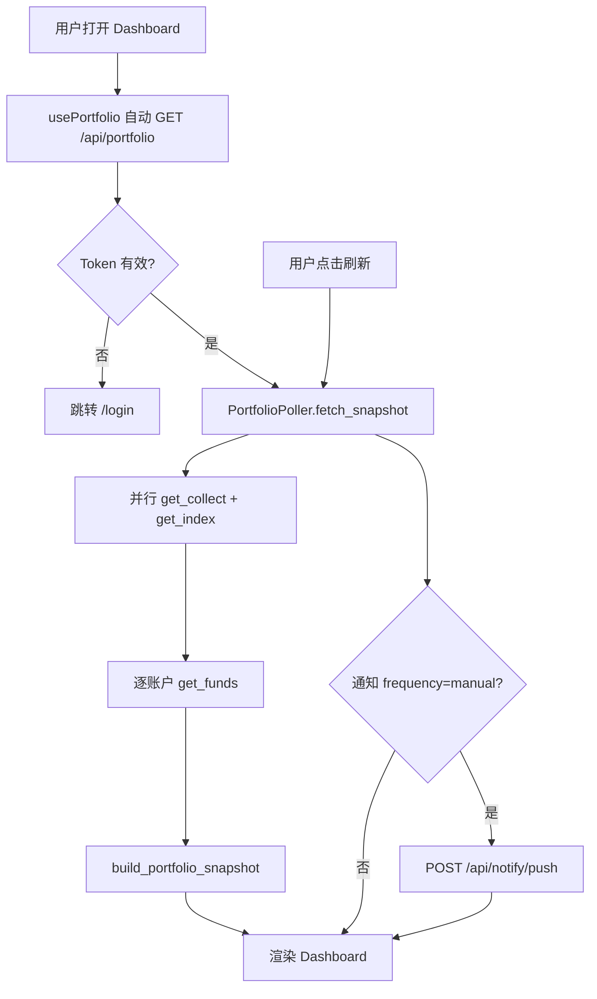
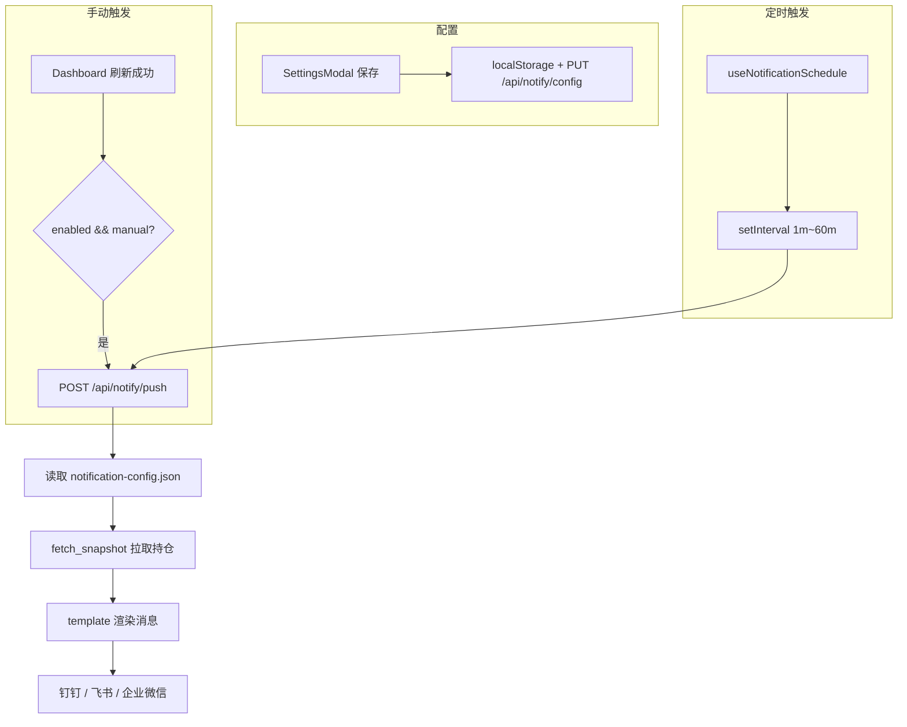
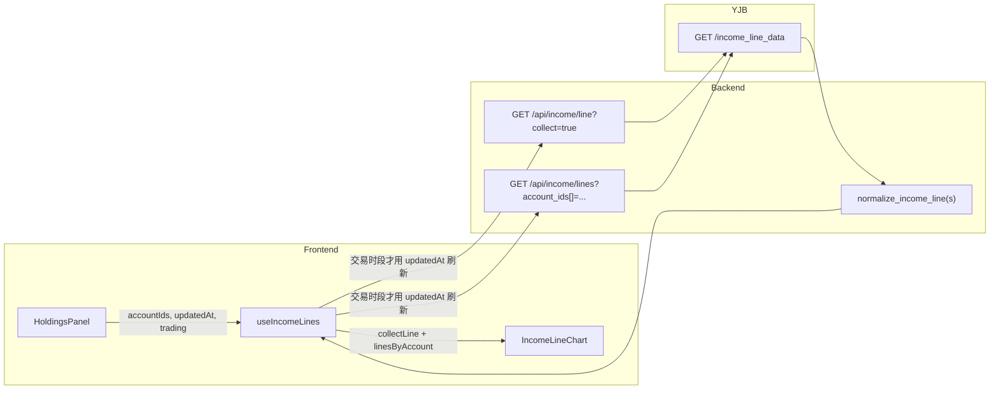
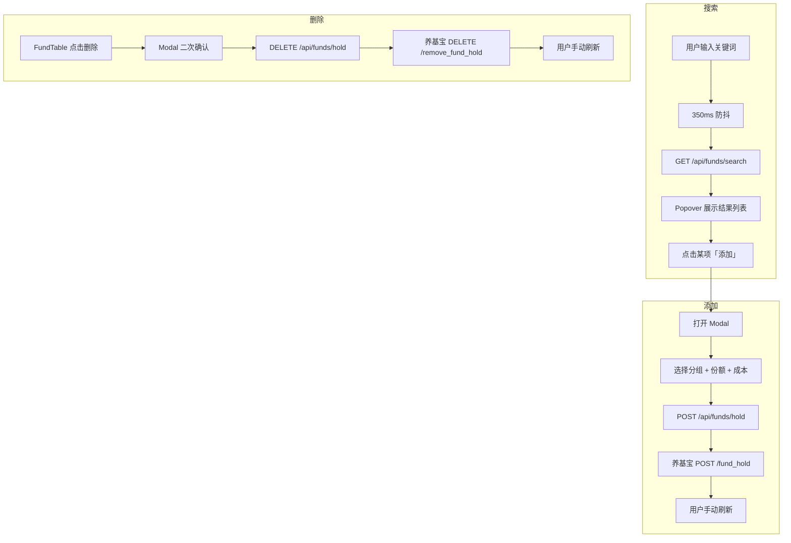
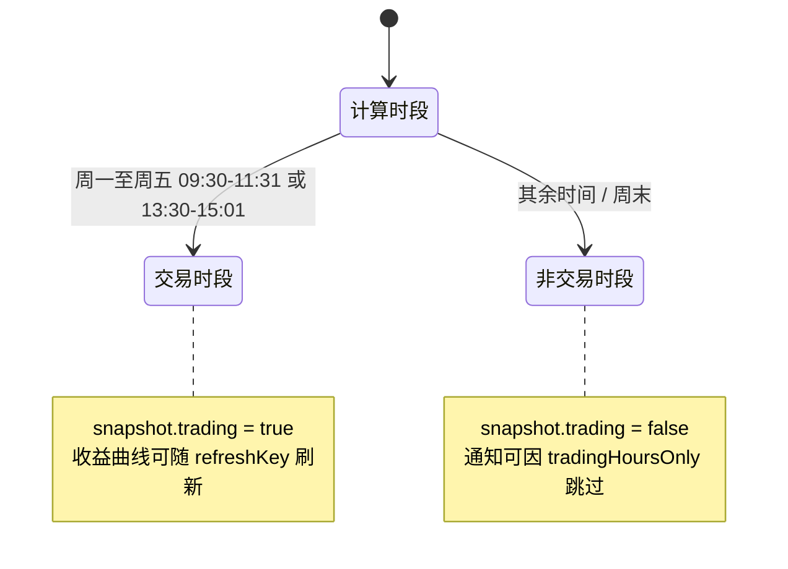

> **fund-helper**：基于养基宝 `browser-plug-api` 的基金收益实时监控面板。  
> 本文档描述项目架构、接口协议、功能模块、数据流与部署方式。上游养基宝原始 API 详见 [API_README.md](/developer/yjb-api)。

---

## 目录

1. [项目概述](#1-项目概述)
2. [技术栈](#2-技术栈)
3. [系统架构](#3-系统架构)
4. [目录结构](#4-目录结构)
5. [后端架构](#5-后端架构)
6. [Web 应用架构](#6-web-应用架构)
7. [功能模块](#7-功能模块)
8. [数据模型](#8-数据模型)
9. [本服务 API 文档](#9-本服务-api-文档)
10. [数据刷新与通知推送](#10-数据刷新与通知推送)
11. [养基宝与东财数据映射](#11-养基宝与东财数据映射)
12. [流程图](#12-流程图)
13. [配置与环境变量](#13-配置与环境变量)
14. [部署与启动](#14-部署与启动)
15. [错误处理与边界情况](#15-错误处理与边界情况)
16. [设计决策与已知限制](#16-设计决策与已知限制)
17. [浏览器插件架构](#17-浏览器插件架构)
18. [桌面端架构](#18-桌面端架构)
19. [VS Code 扩展架构](#19-vs-code-扩展架构)
20. [JetBrains 插件架构](#20-jetbrains-插件架构)

---

## 1. 项目概述

### 1.1 定位

本项目提供 **Web 应用**、**浏览器插件**、**VS Code 扩展** 与 **桌面端** 四种客户端：

- **Web 应用（BFF + 面板）**：FastAPI 代理养基宝 API，统一管理 Token、MD5 签名、数据归一化；扩展 AKShare/东财市场数据；支持钉钉/飞书/企业微信通知推送；Docker 模式下托管前端静态资源。
- **浏览器插件（独立 Popup）**：CRXJS + React 直连养基宝，本地保存登录态，工具栏一键查看持仓；不依赖 fund-helper 后端与 MongoDB。
- **VS Code 扩展（Editor Webview）**：Extension Host + React Webview，侧边栏 / 底部 Panel / 状态栏多入口查看持仓；样式适配编辑器主题；不依赖后端（见 §19）。
- **JetBrains 插件（JCEF）**：Kotlin + JCEF + React Webview，Tool Window / 状态栏 / 底部面板；直连养基宝，不依赖后端（见 §20）。
- **桌面端（Tauri + Rust）**：原生窗口单用户客户端，直连养基宝；本地 SQLite 存通知配置；支持飞书应用 IM 卡片推送、收益曲线、系统托盘；不依赖 MongoDB 与 AKShare。

Web 前端：React 单页应用，通过 REST 按需拉取持仓快照，提供市场排行、板块热力图、通知设置等页面。

### 1.2 核心能力

| 能力 | 说明 |
|------|------|
| 持仓监控 | 手动刷新拉取养基宝持仓，展示大盘指数与汇总卡片 |
| 多账户分组 | Tab 切换全部 / 支付宝 / 天天基金等分组 |
| 收益曲线 | 汇总 + 各分组独立曲线，自研 SVG 图表 |
| 基金管理 | 搜索、添加、删除持仓，可自定义表格列 |
| 市场排行 | 全市场基金多维度排行（AKShare / 东财），支持列配置与基金曲线弹窗 |
| 板块热力图 | 行业/概念板块涨幅或资金流向热力图，可下钻板块关联基金 |
| 通知推送 | 钉钉 / 飞书 / 企业微信，Webhook 或企业应用，定时或刷新后推送持仓收益 |
| 微信扫码登录 | 后端生成高清二维码，Token 持久化 |
| Docker 部署 | 单容器提供 API + 静态前端，数据卷持久化登录态与通知配置 |
| 浏览器插件 | Chrome Popup 直连养基宝，持仓查看、多账户 Tab、基金排序（见 §17） |
| VS Code 扩展 | Editor Webview 直连养基宝，多入口持仓面板、主题适配（见 §19） |
| JetBrains 插件 | JCEF Webview + Kotlin Host，Tool Window / 状态栏 / 底部面板（见 §20） |
| 桌面端 | Tauri 原生客户端：持仓、收益曲线、本地通知推送、飞书应用 IM（见 §18） |

### 1.3 服务端口

| 服务 | 默认端口 | 说明 |
|------|----------|------|
| FastAPI 后端 | `8000` | REST API（本地开发） |
| React Web | `3000` | 开发服务器，代理 `/api` |
| Docker 一体 | `8080` | API + Web 静态资源（`SERVE_STATIC=true`） |

---

## 2. 技术栈

| 层级 | 技术 | 版本/说明 |
|------|------|-----------|
| 后端运行时 | Python | 3.11+（兼容 3.9+） |
| 后端框架 | FastAPI | 异步 REST API |
| HTTP 客户端 | httpx | 异步请求养基宝 API |
| 配置 | pydantic-settings | 读取 `.env`，支持逗号分隔 CORS |
| 市场数据 | akshare | 东财 / 天天基金接口封装 |
| 二维码 | qrcode + Pillow | 后端生成 PNG base64 |
| 前端框架 | React | 19（`web/`） |
| 语言 | TypeScript | 严格类型 |
| 构建 | Rsbuild | 替代 CRA/Vite |
| UI | Ant Design | 6.x，中文 locale |
| 路由 | react-router-dom | 7.x |
| 样式 | Sass + 内联 style | 无 CSS Modules |
| 代码规范 | Biome | lint + format |
| 浏览器插件 | CRXJS + Vite + React 19 | Manifest V3 Popup，见 `chrome-extension/` |
| VS Code 扩展 | Extension Host (esbuild) + Webview (Vite + React 19) | 见 `vscode-extension/` |
| 桌面端 | Tauri v2 + Rust + React 19 + Tailwind v4 | 原生窗口，见 `desktop/` |

---

## 3. 系统架构

### 3.1 三层架构

```
┌─────────────────────────────────────────────────────────────────┐
│                        用户浏览器 (:3000 / :8080)                │
│  React SPA ── REST (/api/*)                                     │
└────────────────────────────┬────────────────────────────────────┘
                             │ dev proxy / Docker 同域 / Nginx 反代
┌────────────────────────────▼────────────────────────────────────┐
│                   FastAPI BFF 服务 (:8000 / :8080)               │
│  ┌──────────┐  ┌──────────┐  ┌──────────┐  ┌─────────────────┐ │
│  │ REST API │  │  Market  │  │  Notify  │  │   AuthStore     │ │
│  │ routes   │  │ AKShare  │  │ 推送服务  │  │   MongoDB       │ │
│  └────┬─────┘  └────┬─────┘  └────┬─────┘  └─────────────────┘ │
│       │             │             │                              │
│       └─────────────┴──────┬──────┘                              │
│                            ▼                                     │
│                    ┌──────────────┐                              │
│                    │  YjbClient   │  MD5 签名 + Authorization   │
│                    │  calculator  │  数据归一化 / 收益计算        │
│                    │  Poller      │  按需拉取持仓快照             │
│                    └──────┬───────┘                              │
└───────────────────────────┼──────────────────────────────────────┘
                            │ HTTPS
        ┌───────────────────┴───────────────────┐
        ▼                                       ▼
┌───────────────────────┐           ┌──────────────────────────────┐
│ 养基宝 browser-plug-api │           │ 东方财富 / 天天基金 (东财)      │
│ account_collect ...   │           │ AKShare 拉取排行 / 热力图 / 曲线 │
└───────────────────────┘           └──────────────────────────────┘
```

### 3.2 数据流原则

1. **持仓主数据**：前端 `usePortfolio` → REST `GET /api/portfolio` → `PortfolioPoller.fetch_snapshot()` → 养基宝
2. **手动刷新**：Dashboard 刷新按钮 → 同上 → 可选触发通知推送
3. **收益曲线**：前端 `useIncomeLines` → REST `/api/income/*` → 养基宝（按需拉取）
4. **基金增删**：前端 REST → 养基宝 → 用户手动刷新更新快照
5. **市场数据**：市场排行 / 热力图 / 基金曲线 → REST `/api/market/*` → AKShare / 东财（与养基宝独立）
6. **通知推送**：设置页保存配置 → MongoDB `notification_configs` → 定时或刷新后 `POST /api/notify/push`
7. **登录**：扫码成功 → 创建用户与会话 → 设置 Cookie

### 3.3 组件依赖关系（后端）

```
main.py (lifespan)
  ├── auth/                  ← 多用户 Session Cookie
  ├── user_repo / session_repo
  └── PortfolioPoller        ← 按需拉取持仓快照（无后台轮询）
        ├── YjbClient        ← 养基宝 HTTP
        └── calculator       ← build_portfolio_snapshot / normalize_income_line

api/routes.py                ← REST 端点
market/*                     ← 排行 / 热力图 / 基金曲线（AKShare）
notify/*                     ← 配置持久化 / 连通性测试 / 推送
```

### 3.4 组件依赖关系（前端）

```
App.tsx
  ├── ConfigProvider (antd 主题)
  ├── ProtectedRoute   → api.getAuthStatus()
  ├── Login            → 扫码登录流程
  ├── Dashboard        → 持仓主页
  ├── MarketRanking    → /market 市场排行
  └── MarketHeatmap    → /market/heatmap 板块热力图

Dashboard
  ├── usePortfolio         → REST 持仓快照 + 手动刷新
  ├── useNotificationSchedule → 定时通知推送
  ├── IndexBar             ← portfolio.indices
  ├── SummaryCard × 4      ← portfolio 汇总字段
  ├── SettingsModal        → 通知渠道配置
  └── HoldingsPanel
        ├── useIncomeLines   → REST 收益曲线
        ├── FundSearch       → 搜索/添加
        ├── IncomeLineChart  → SVG 曲线
        ├── AccountSummaryCard
        └── FundTable        → 删除持仓、列配置
```

### 3.5 浏览器插件架构（独立客户端）

```
┌─────────────────────────────────────────────────────────────────┐
│              Chrome / Edge Popup（400×600，MV3）                 │
│  React App（chrome-extension/src）                               │
│  ┌─────────────┐  ┌──────────────────────────────────────────┐  │
│  │ LoginView   │  │ PortfolioView                            │  │
│  │ QR 轮询登录  │  │ 指数 / 汇总 / Tab / 基金列表 / 排序       │  │
│  └──────┬──────┘  └──────────────────┬───────────────────────┘  │
│         │                            │                          │
│         └────────────┬───────────────┘                          │
│                      ▼                                          │
│              ┌──────────────┐    ┌─────────────────┐            │
│              │  yjb.ts      │    │ chrome.storage  │            │
│              │  portfolio.ts│    │ .local (Session)│            │
│              │  fundSort.ts │    └─────────────────┘            │
│              └──────┬───────┘                                   │
└─────────────────────┼───────────────────────────────────────────┘
                      │ HTTPS（浏览器 fetch，无 BFF）
                      ▼
            ┌───────────────────────┐
            │ 养基宝 browser-plug-api │
            └───────────────────────┘
```

**与 Web 应用的关系**：

| 维度 | Web 应用 | 浏览器插件 |
|------|----------|------------|
| 数据路径 | 浏览器 → FastAPI → 养基宝 | 浏览器 → 养基宝 |
| 登录 | 账号密码 + 养基宝绑定 | 独立微信扫码 |
| 会话存储 | MongoDB + Cookie | `chrome.storage.local` |
| 签名实现 | `backend/app/yjb/client.py` | `chrome-extension/src/lib/yjb.ts` |
| 快照聚合 | `calculator.py` | `portfolio.ts`（逻辑对齐） |

插件**不包含**市场排行、热力图、通知推送、收益曲线、基金增删等多用户 Web 能力。

### 3.6 桌面端架构（Tauri 客户端）

```
┌─────────────────────────────────────────────────────────────────┐
│  React UI（desktop/src）  Ant Design + Tailwind + 主题切换        │
│  portfolio / settings / login                                    │
└───────────────────────────────┬─────────────────────────────────┘
                                │ Tauri invoke（无本地 HTTP）
                                ▼
┌─────────────────────────────────────────────────────────────────┐
│  Rust（desktop/src-tauri/src）                                   │
│  commands.rs  yjb.rs  portfolio.rs  income.rs  db.rs             │
│  notify/  push · scheduler · feishu_app · feishu_card · webhook  │
└───────────────────────────────┬─────────────────────────────────┘
                                │ HTTPS
                                ▼
                    养基宝 browser-plug-api
```

| 维度 | Web 应用 | 桌面端 |
|------|----------|--------|
| 数据路径 | 浏览器 → FastAPI → 养基宝 | Tauri → Rust → 养基宝 |
| 登录 | 账号密码 + 养基宝绑定 | 微信扫码 |
| 会话存储 | MongoDB + Cookie | SQLite `app_profile.yjb_token` |
| 通知配置 | MongoDB `notification_configs` | SQLite `notification_config` |
| 签名实现 | `yjb/client.py` | `yjb.rs` |
| 快照聚合 | `calculator.py` | `portfolio.rs` |
| 飞书卡片 | `notify/template.py` | `notify/feishu_card.rs` |

桌面端**不包含**市场排行、热力图、多用户；通知推送逻辑对齐 Web `notify/service.py`，消息尾部标识 `Fund Helper · Desktop`。

### 3.7 VS Code 扩展架构（Editor Webview 客户端）

```
┌──────────────────────────────────────────────────────────────────────────┐
│  Cursor / VS Code                                                        │
│  ┌─────────────────────┐    postMessage     ┌──────────────────────────┐ │
│  │ Webview（React 19）  │ ◄──────────────► │ Extension Host（Node）    │ │
│  │ LoginView           │                   │ extension.ts              │ │
│  │ PortfolioView       │                   │ fundHelperController.ts   │ │
│  │ panel.css (--vscode)│                   │ yjb.ts · portfolio.ts     │ │
│  └─────────────────────┘                   │ sessionStore (globalState)│ │
│         ▲                                   └────────────┬─────────────┘ │
│         │  WebviewView / WebviewPanel                    │ fetch         │
│  活动栏 / Panel / 状态栏 / 标题栏命令                      ▼               │
└──────────────────────────────────────────────────────────┼───────────────┘
                                                             ▼
                                               养基宝 browser-plug-api
```

| 维度 | 浏览器插件 | VS Code 扩展 |
|------|------------|--------------|
| UI 容器 | Chrome Popup 400×600 | 侧边栏 / 底部 Panel / WebviewPanel |
| 网络层 | Popup 内 `fetch` | **Extension Host** `fetch`（Webview CSP 禁外网） |
| 通信 | 同进程 | `postMessage` 双向 |
| 会话存储 | `chrome.storage.local` | `ExtensionContext.globalState` |
| 样式 | 硬编码色 `popup.css` | `--vscode-*` 主题变量 `panel.css` |
| 激活策略 | 点击工具栏图标 | 懒加载：打开视图或执行命令时激活 |

入口示意见 [vscode-extension/docs/entry-points.png](/entry-points.png) 与 [vscode-extension/README.md](/clients/vscode-extension#入口一览)。

---

## 4. 目录结构

```
fund-helper/
├── TECH.md                 # 本文档
├── README.md               # 快速入门
├── API_README.md           # 养基宝上游 API 逆向文档
├── Dockerfile              # 多阶段构建（Web + 后端）
├── docker-compose.yml      # 单容器部署
├── .env.docker.example     # Docker 环境变量示例
├── reset.sh                # 清除依赖与 Docker 卷
├── start.sh                # 一键启动脚本
│
├── backend/
│   ├── requirements.txt
│   ├── .env                # 可选环境变量
│   └── app/
│       ├── main.py         # FastAPI 入口、CORS、lifespan、SPA 静态托管
│       ├── config.py       # 配置项
│       ├── db/             # MongoDB 连接
│       │   ├── mongo.py
│       │   └── collections.py
│       ├── api/
│       │   └── routes.py   # REST API (/api)
│       ├── market/         # 市场数据（AKShare / 东财）
│       │   ├── network.py  # 东财直连、绕过系统代理
│       │   ├── fund_rank.py
│       │   ├── heatmap.py
│       │   ├── fund_curve.py
│       │   ├── sector_funds.py
│       │   ├── benchmark_curve.py
│       │   └── schemas.py
│       ├── notify/         # 通知推送
│       │   ├── config_store.py
│       │   ├── service.py
│       │   ├── template.py
│       │   ├── delivery.py
│       │   ├── delivery_catalog.py
│       │   └── feishu_group.py
│       ├── services/
│       │   └── poller.py   # 按需拉取持仓快照
│       └── yjb/
│           ├── client.py   # 养基宝 HTTP 客户端
│           ├── auth_store.py
│           └── calculator.py
│
├── web/
    ├── rsbuild.config.ts   # 构建 + dev 代理
    ├── package.json
    └── src/
        ├── index.tsx
        ├── App.tsx
        ├── api/client.ts   # REST 封装
        ├── hooks/
        │   ├── usePortfolio.ts
        │   ├── useIncomeLines.ts
        │   └── useNotificationSchedule.ts
        ├── types/
        │   ├── portfolio.ts
        │   └── market.ts
        ├── pages/
        │   ├── Dashboard/Dashboard.tsx
        │   ├── Login/Login.tsx
        │   ├── MarketRanking/MarketRanking.tsx
        │   └── MarketHeatmap/MarketHeatmap.tsx
        ├── components/
        │   ├── IndexBar/
        │   ├── SummaryCard/
        │   ├── HoldingsPanel/
        │   ├── AccountSummaryCard/
        │   ├── AccountIcon/
        │   ├── IncomeLineChart/
        │   ├── IncomeSparkline/
        │   ├── FundTable/
        │   ├── FundSearch/
        │   ├── FundCurveModal/
        │   ├── SectorFundsModal/
        │   ├── SeriesLineChart/
        │   └── SettingsModal/
        └── utils/
            ├── format.ts
            ├── incomeChart.ts
            ├── heatmap.ts
            ├── fundTableColumns.ts
            ├── marketRankColumns.ts
            ├── notificationSettings.ts
            ├── notificationPush.ts
            └── notificationConnectivity.ts

└── chrome-extension/           # 浏览器插件（见 §17）
    ├── manifest.config.ts      # MV3 清单
    ├── vite.config.ts
    ├── index.html
    ├── public/icons/
    └── src/
        ├── App.tsx
        ├── components/         # LoginView / PortfolioView
        ├── lib/                # yjb / portfolio / fundSort / storage
        ├── types/
        └── styles/popup.css

├── vscode-extension/           # VS Code / Cursor 扩展（见 §19）
│   ├── package.json            # contributes：views、commands、menus
│   ├── esbuild.mjs             # Extension Host → dist/extension.js
│   ├── vite.webview.config.ts  # Webview React → dist/webview/
│   ├── media/fund-helper.svg   # 活动栏 24×24 单色图标
│   ├── docs/entry-points.png   # 入口示意图
│   └── src/
│       ├── extension.ts
│       ├── fundHelperController.ts
│       ├── yjb.ts · portfolio.ts · sessionStore.ts
│       └── webview/            # React UI（对齐 chrome-extension 组件）

├── jetbrains-extension/        # JetBrains IDE 插件（见 §20）
│   ├── build.gradle.kts        # IntelliJ Platform Gradle Plugin
│   ├── src/main/kotlin/        # Kotlin Host：yjb / portfolio / ui / statusbar
│   ├── webview/src/            # React UI（与 vscode-extension 同源）
│   └── src/main/resources/webview/  # Vite 构建产物

├── desktop/                    # 桌面端（见 §18）
│   ├── src/                    # React UI
│   ├── src-tauri/src/          # Rust 后端
│   │   ├── yjb.rs
│   │   ├── portfolio.rs
│   │   ├── income.rs
│   │   ├── db.rs
│   │   ├── commands.rs
│   │   └── notify/
│   └── README.md
│
├── assets/releases/            # 客户端安装包（本地构建或 CI collect）
├── publish-chrome.sh           # Chrome 发版脚本
├── publish-vscode.sh           # VS Code 发版脚本
├── publish-jetbrains.sh        # JetBrains 发版脚本
├── publish-desktop.sh          # 桌面发包脚本
└── .github/workflows/
    ├── chrome-release.yml
    ├── vscode-release.yml
    ├── jetbrains-release.yml
    └── desktop-release.yml     # macOS + Windows CI 发布
```

---

## 5. 后端架构

### 5.1 应用生命周期 (`main.py`)

```python
@asynccontextmanager
async def lifespan(app):
    auth_store = AuthStore()
    poller = PortfolioPoller(auth_store)

    app.state.auth_store = auth_store
    app.state.poller = poller
    app.state.notify_config_store = NotificationConfigStore()
    app.state.qr_sessions = {}

    yield
```

`SERVE_STATIC=true` 时，`_mount_web()` 挂载 `web/dist` 并提供 SPA fallback（`/api`、`/docs` 除外）。

### 5.2 YjbClient — 养基宝 HTTP 客户端

**签名算法**（与插件一致）：

```
Request-Sign = MD5(url_path + token + timestamp + API_SECRET)
```

**请求头**：

| Header | 值 |
|--------|-----|
| `Content-Type` | `application/json` |
| `Authorization` | 登录 token，未登录为空 |
| `Request-Time` | Unix 秒级时间戳 |
| `Request-Sign` | 32 位小写 MD5 hex |

**错误处理**：

- HTTP 401 或 body 含「token/登录/授权」→ `YjbApiError(status_code=401)`
- HTTP 429 → 请求频繁
- `code != 200` → 业务错误

### 5.3 认证与用户（MongoDB + Session Cookie）

**两层认证**：

1. **应用登录**：用户名 + 密码（bcrypt），Cookie `fund_helper_session`
2. **养基宝绑定**：持仓相关 API 需当前用户已绑定 `yjb_token`；未绑定或过期时返回 `yjb_not_bound` / `yjb_token_expired`，前端展示扫码绑定页

**集合**：

| 集合 | 说明 |
|------|------|
| `users` | 本地账号（`username` 唯一）+ 可选养基宝 Token / 昵称 / 头像 |
| `sessions` | 浏览器会话 |
| `notification_configs` | `_id` = `user_id` |

首次启动 `ensure_default_admin()` 创建管理员（`ADMIN_USERNAME` / `ADMIN_PASSWORD`，默认 `admin` / `123456`）。用户 CRUD 见 `/api/admin/users`。

### 5.4 PortfolioPoller — 按需拉取

> 无后台定时轮询、无 WebSocket。每次 `GET /api/portfolio` 或通知推送前实时请求养基宝。

**交易时段判断** `is_trading_hours()`：

| 条件 | 结果 |
|------|------|
| 周六、周日 | 非交易 |
| 09:30 – 11:31 | 交易 |
| 13:30 – 15:01 | 交易 |
| 其余时间 | 非交易 |

**`fetch_snapshot()` 拉取顺序**：

1. 并行：`get_collect()` + `get_index()`
2. 串行：对每个 `account_data[].account_id` 调用 `get_funds(account_id)`
3. `build_portfolio_snapshot()` 组装
4. 附加 `updated_at`、`user`、`trading`

### 5.5 Market — 市场数据模块

| 文件 | 职责 |
|------|------|
| `network.py` | 启动时 patch `requests` / AKShare，东财域名直连、绕过 Clash 等系统代理 |
| `fund_rank.py` | 全市场基金排行，多维度排序与分页 |
| `heatmap.py` | 行业/概念板块涨幅或资金流向热力图 |
| `fund_curve.py` | 单只基金累计收益 / 净值曲线 |
| `sector_funds.py` | 板块关联基金列表 |
| `benchmark_curve.py` | 板块 vs 上证 / 创业板指对比叠加 |

数据来源：AKShare 封装东方财富、天天基金公开接口，**不经过养基宝**。

### 5.6 Notify — 通知推送模块

| 文件 | 职责 |
|------|------|
| `config_store.py` | 读写 MongoDB `notification_configs` |
| `template.py` | 持仓收益文本 / 飞书交互卡片模板 |
| `service.py` | 连通性测试、多渠道推送（Webhook + 企业应用） |
| `delivery.py` | 解析钉钉 / 飞书 / 企业微信应用投递目标 |
| `delivery_catalog.py` | 拉取可投递会话列表 |
| `feishu_group.py` | 一键创建飞书通知群 |

**支持渠道**：

| 平台 | Webhook 群机器人 | 企业应用 |
|------|------------------|----------|
| 钉钉 | ✓ | ✓ |
| 飞书 | ✓ | ✓ |
| 企业微信 | ✓（key 参数） | ✓ |

### 5.7 Calculator — 数据归一化

| 函数 | 职责 |
|------|------|
| `calc_fund_day_earn()` | `money × gszzl / 100`，当日预估收益 |
| `enrich_fund()` | 标准化单只基金字段（含 nv_info、day_earn、day_rate） |
| `build_portfolio_snapshot()` | 组装 accounts / funds / indices 完整快照 |
| `_normalize_index_dir()` | 指数涨跌幅：用 `div` 符号校正 `dir` |
| `normalize_income_line()` | 收益曲线单条归一化 |
| `normalize_income_lines()` | 批量账户曲线归一化 |

**收益曲线重要逻辑**：

- 汇总：使用 `data.collect`
- 指定分组：使用 `data[str(account_id)]`，**不回退**到 collect（各分组曲线独立）

---

## 6. Web 应用架构

### 6.1 路由

| 路径 | 组件 | 守卫 |
|------|------|------|
| `/` | `Dashboard` | `ProtectedRoute` 需登录 |
| `/market` | `MarketRanking` | 需登录 |
| `/market/heatmap` | `MarketHeatmap` | 需登录 |
| `/login` | `Login` | 无 |
| `*` | 重定向到 `/` | — |

### 6.2 状态管理

**无 Redux/Zustand**，采用分层本地 state：

| 层级 | 位置 | 数据 |
|------|------|------|
| 持仓层 | `usePortfolio` | `portfolio`（Dashboard 主数据源） |
| 页面层 | `Dashboard` | 头像加载失败 flag、设置弹窗 |
| 页面层 | `Login` | 二维码、轮询状态 |
| 页面层 | `MarketRanking` / `MarketHeatmap` | 筛选条件、表格/热力图数据 |
| 组件层 | `HoldingsPanel` | `activeTab` |
| 组件层 | `FundSearch` | 关键词、结果、添加 Modal |
| 组件层 | `SettingsModal` | 通知渠道配置（localStorage + 服务端同步） |
| Hook 层 | `useIncomeLines` | 曲线数据、loading、error |
| Hook 层 | `useNotificationSchedule` | 定时推送 interval |

数据流：**REST → usePortfolio → Dashboard → props 下发子组件**。

### 6.3 自定义 Hooks

#### `usePortfolio`

- 挂载时 `GET /api/portfolio` 加载首屏
- `refresh()` 手动刷新，返回最新快照
- 401 时触发 `onAuthRequired` 跳转登录
- 返回 `{ portfolio, loading, refreshing, error, refresh }`

#### `useIncomeLines(accountIds, refreshKey?, trading?)`

- 并行请求：汇总曲线 `collect=true` + 各账户 `account_ids[]`
- **仅交易时段**将 `updatedAt` 作为 `refreshKey`，非交易时段只拉一次
- 返回 `{ collectLine, linesByAccount, loading, error }`

#### `useNotificationSchedule`

- 读取 `notificationSettings` 中的触发频次
- 支持 1m / 5m / 15m / 30m / 60m 定时调用 `POST /api/notify/push`
- 配置变更时监听 `fund-helper-notification-config-changed` 事件重建 interval

### 6.4 视觉规范

| 元素 | 值 |
|------|-----|
| 主色 / 涨 | `#fc4e50` |
| 跌 | `#07b360` |
| 平盘 / 次要文字 | `#8b95a8` |
| 页面背景 | `#f5f7fb` |
| 圆角 | `10px` |
| 数字字体 | `.mono` 等宽 |

`format.ts` 提供 `trendColor(value)`：正数红、负数绿、零灰。

### 6.5 开发代理 (`rsbuild.config.ts`)

```typescript
proxy: {
  '/api': { target: 'http://127.0.0.1:8000' },
}
```

Docker / 生产模式下前端与 API 同域，无需代理。

---

## 7. 功能模块

### 7.1 登录模块

| 环节 | 实现 |
|------|------|
| 二维码获取 | `POST /api/auth/qrcode` → 养基宝 `/qr_code` → 后端 qrcode 库生成 PNG base64 |
| 状态轮询 | 前端每 2s 调用 `GET /api/auth/qrcode/{id}/status` |
| 状态码 | `0` 等待 / `1` 已扫码 / `2` 成功 / `3` 失效 |
| Token 保存 | `state==2` 时 `AuthStore.save()` |
| 过期 | 前端 4 分钟超时，提示刷新 |
| 头像 | `GET /api/auth/avatar` 代理 CDN，避免浏览器跨域/直连失败 |

### 7.2 持仓监控模块

| 组件 | 数据源 | 展示内容 |
|------|--------|----------|
| `IndexBar` | `portfolio.indices` | 四大指数名称、点位、涨跌幅 |
| `SummaryCard` × 4 | `portfolio` 汇总字段 | 总资产、当日收益、净涨跌、账户数 |
| `HoldingsPanel` | `portfolio.accounts` | Tab 分组切换 |

Dashboard 右上角提供**刷新**按钮，调用 `usePortfolio.refresh()` 重新拉取养基宝数据；刷新成功后可按通知配置触发推送。

### 7.3 持仓面板模块 (`HoldingsPanel`)

**Tab「全部」**：

- `IncomeLineChart`：汇总当日收益曲线
- `AccountSummaryCard` 网格：各分组摘要 + `IncomeSparkline` 迷你曲线
- 点击卡片切换到对应账户 Tab

**Tab「单账户」**：

- `IncomeLineChart`：该分组独立曲线
- `FundTable`：基金明细表格

**Tab 栏右侧**：

- `FundSearch`（compact 模式）：搜索框 + Popover 结果列表

### 7.4 收益曲线模块

**后端拉取策略**（`YjbClient.get_income_line_data`）：

| 场景 | 养基宝参数 |
|------|------------|
| 汇总 | `date_type=day&collect=true` |
| 多分组 | `date_type=day&account_ids[]=id1&account_ids[]=id2` |

> 注意：文档写 `account_id + collect=false`，实测必须用 `account_ids[]` 才能拿到各分组独立曲线。

**前端图表**（`incomeChart.ts` + `IncomeLineChart`）：

- 自研 SVG，非 ECharts
- 时间轴按数据点 index 均匀映射（午休不留空）
- X 轴仅显示首末时间（如 09:30、15:00）
- 线条颜色由当日盈亏决定（`incomeTrendColor`）：盈红亏绿
- Hover 显示时间与收益率

### 7.5 基金管理模块

| 操作 | API | 后续 |
|------|-----|------|
| 搜索 | `GET /api/funds/search?keyword=` | 350ms 防抖，Popover 展示 |
| 添加 | `POST /api/funds/hold` | 选分组、填份额/成本 → 用户手动刷新 |
| 删除 | `DELETE /api/funds/hold` | Modal 二次确认 → 用户手动刷新 |

搜索支持：基金代码、名称、拼音简写、主题标签。

`FundTable` 与 `MarketRanking` 均支持**自定义可见列**，偏好保存在 localStorage（`fund-helper-fund-table-visible-columns`、`fund-helper-market-rank-visible-columns-v2`）。

### 7.6 市场排行模块 (`MarketRanking`)

- 路由：`/market`
- 数据源：`GET /api/market/rank`，筛选项来自 `/api/market/rank/options`
- 支持维度：当天 / 近 1 周~3 年 / 实时估计涨幅
- 支持范围：全部开放式 / 指数型；按基金类型、指数板块、主题板块筛选
- 点击基金名称打开 `FundCurveModal`，拉取 `/api/market/fund/{code}/curve`
- 列显示/排序偏好持久化到 localStorage

### 7.7 板块热力图模块 (`MarketHeatmap`)

- 路由：`/market/heatmap`
- 数据源：`GET /api/market/heatmap`
- 两种模式：`sector_change`（板块涨幅）、`fund_flow`（资金流向）
- 板块类型：行业 / 概念；资金流向指标：今日 / 5 日 / 10 日
- 点击板块格打开 `SectorFundsModal`，拉取 `/api/market/sector/funds`

### 7.8 通知推送模块 (`SettingsModal`)

**配置结构**（v1）：

```
NotificationConfig
├── enabled          总开关
├── trigger          frequency + tradingHoursOnly
└── channels
    └── dingtalk | feishu | wecom
        ├── webhook  群机器人 URL + 签名
        └── app      企业应用凭据 + 投递目标
```

**触发策略**：

| frequency | 行为 |
|-----------|------|
| `manual` | 仅手动刷新成功后推送 |
| `1m` ~ `60m` | 前端 `useNotificationSchedule` 定时调用 push |
| `daily_close` | 预留（每日收盘汇总） |

**持久化**：设置页保存时同步到 localStorage 与服务端 MongoDB（按 `user_id` 隔离）。

**推送内容**：持仓汇总、各账户收益、Top 涨跌基金；飞书支持交互卡片。

### 7.9 账户图标模块 (`AccountIcon`)

根据账户名称正则匹配平台图标：

| 匹配 | 字形 | 颜色 |
|------|------|------|
| 支付宝 | 支 | `#1677ff` |
| 天天/东方财富 | 天 | `#ff6a00` |
| 且慢/蛋卷 | 蛋 | `#faad14` |
| 微信 | 微 | `#07c160` |
| 银行 | 银 | `#64748b` |
| 默认 | 首字 | `#8b95a8` |

---

## 8. 数据模型

### 8.1 PortfolioSnapshot（持仓 API 响应主体）

```typescript
interface PortfolioSnapshot {
  total_assets: number;        // 总资产
  today_income: number;        // 当日总收益
  today_income_rate: number;   // 当日收益率 %
  rise_count: number;          // 上涨基金数（各账户 up 之和）
  fall_count: number;          // 下跌基金数
  accounts: AccountItem[];     // 分组列表
  funds: FundItem[];           // 全账户合并，按 |day_earn| 降序
  indices: IndexItem[];        // 四大指数
  updated_at?: string;         // ISO 时间，如 "2026-06-12T15:00:01"
  trading?: boolean;           // 是否交易时段
  user?: { nickname?: string; avatar?: string };
}
```

### 8.2 AccountItem

```typescript
interface AccountItem {
  account_id: number;
  title: string;               // 如「支付宝」「天天基金」
  today_income: number;
  today_income_rate: number;
  hold_income: number;         // 持有收益
  hold_income_rate: number;
  account_assets: number;
  up: number;                  // 该分组上涨基金数
  down: number;
  funds: FundItem[];
}
```

### 8.3 FundItem（核心字段）

```typescript
interface FundItem {
  id: number;                  // 持仓记录 ID（删除时用）
  fund_id: number;             // 基金 ID（添加时用）
  code: string;                // 如 "161725"
  short_name: string;
  money: number;               // 市值
  hold_share: number;          // 份额
  hold_cost: number;           // 成本
  hold_earn: number;           // 持有收益
  day_earn: number;            // 当日预估收益（后端计算）
  day_rate: number;            // 当日涨跌幅 %
  nv_info?: {
    dwjz: number;              // 单位净值
    gzjz: number;              // 估算净值
    gszzl: number;             // 估算涨跌幅 %
    jzzzl: number;             // 净值涨跌幅 %
    jzrq: string;              // 净值日期
    gztime: string;            // 估值时间
  };
  sector?: string;             // 板块
}
```

### 8.4 IncomeLineData

```typescript
interface IncomeLineData {
  account_id?: number;
  day: string;                 // 交易日，如 "2026-06-12"
  today_income: number;
  points: Array<{
    label: string;             // 时间，如 "09:35"
    rate: number;              // 累计收益率 %
  }>;
}
```

### 8.5 当日收益计算公式

```
rate = pickEstimateRate(nv)  // gszzl → zsgzzl → vgszzl，均为空则 jzzzl → rzzl
day_earn = round(money × rate / 100, 2)
day_rate = estimateRate != 0 ? estimateRate : publishedRate
```

`nv_info` 字段优先级与实测说明见 [API_README.md §7](/developer/yjb-api#7-持仓基金列表)（含 QDII/港股 `vgszzl` / `vgsz` 回退）。

---

## 9. 本服务 API 文档

> Base URL：`http://localhost:8000`（开发环境经前端代理访问 `/api`）

### 9.1 健康检查

```
GET /api/health
```

**响应**：`{ "status": "ok" }`

---

### 9.2 认证

#### 获取登录状态

```
GET /api/auth/status
```

**响应**：

```json
{
  "logged_in": true,
  "nickname": "用户昵称",
  "avatar": "https://cdn.yangjibao.com/...",
  "login_time": "2026-06-12 10:30:00"
}
```

#### 获取用户头像（代理）

```
GET /api/auth/avatar
```

- 需登录且有 avatar
- 返回二进制图片，`Cache-Control: private, max-age=3600`
- 404：无头像；502：CDN 加载失败

#### 登出

```
POST /api/auth/logout
```

**响应**：`{ "ok": true }`  
**副作用**：清空 Token

#### 创建登录二维码

```
POST /api/auth/qrcode
```

**响应**：

```json
{
  "id": "qr_session_id",
  "url": "weixin://...",
  "image_base64": "iVBORw0KGgo..."
}
```

#### 轮询扫码状态

```
GET /api/auth/qrcode/{qr_id}/status
```

**响应**：

```json
{
  "state": "2",
  "nickname": "用户昵称",
  "avatar": "https://..."
}
```

| state | 含义 |
|-------|------|
| `0` | 等待扫码 |
| `1` | 已扫码，待确认 |
| `2` | 登录成功（后端自动保存 Token） |
| `3` | 二维码失效 |

---

### 9.3 持仓快照

#### 获取当前快照

```
GET /api/portfolio
```

- 实时拉取养基宝并组装 `PortfolioSnapshot`（需登录）
- 无服务端缓存，每次请求均访问上游

---

### 9.4 账户

```
GET /api/accounts
```

返回养基宝 `user_account` 原始 `data`（需登录）。

---

### 9.5 收益曲线

#### 单条曲线

```
GET /api/income/line?collect=true
GET /api/income/line?account_id={id}
GET /api/income/line?account_ids[]={id}
```

| 参数 | 说明 |
|------|------|
| `collect=true` | 汇总曲线 |
| `account_id` | 单分组（内部转为 account_ids） |
| `account_ids[]` | 多分组时取第一个 |

**响应**：`IncomeLineData`

#### 批量分组曲线

```
GET /api/income/lines?account_ids[]=1&account_ids[]=2
```

**响应**：

```json
{
  "1": { "account_id": 1, "day": "...", "today_income": 0, "points": [...] },
  "2": { "account_id": 2, "day": "...", "today_income": 0, "points": [...] }
}
```

---

### 9.6 基金搜索与持仓管理

#### 搜索基金

```
GET /api/funds/search?keyword=白酒&account_id=1
```

| 参数 | 必填 | 说明 |
|------|------|------|
| `keyword` | 是 | 代码/名称/拼音/主题 |
| `account_id` | 否 | 限定分组 |

**响应**：`SearchFundItem[]`（养基宝原始结构）

#### 添加持仓

```
POST /api/funds/hold
Content-Type: application/json
```

**请求体**：

```json
{
  "account_id": 1,
  "items": [
    {
      "fund_id": 12345,
      "fund_code": "161725",
      "hold_share": "100.0000",
      "hold_cost": "1.5000",
      "model": 1
    }
  ]
}
```

**响应**：`{ "ok": true, "data": ... }`

#### 删除持仓

```
DELETE /api/funds/hold?account_id=1&fund_ids[]=100&fund_ids[]=101
```

**响应**：`{ "ok": true, "data": ... }`

---

### 9.7 通知推送

#### 读取 / 保存配置

```
GET /api/notify/config
PUT /api/notify/config
```

持久化到 MongoDB `notification_configs` 集合，请求体/响应为 `{ "config": NotificationConfig | null }`。

#### 拉取投递目标

```
POST /api/notify/delivery-targets/{channel}
```

`channel`：`dingtalk` | `feishu` | `wecom`。根据企业应用凭据返回可投递群聊列表。

#### 创建飞书通知群

```
POST /api/notify/feishu/create-notification-group
```

为当前用户创建「你 + 机器人」专属群，返回 `chatId` 供应用 IM 投递。

#### 连通性测试

```
POST /api/notify/test
```

请求体：`{ "channel": "feishu", "config": NotificationConfig }`  
发送测试消息（含当前持仓快照，拉取失败则发占位文案）。

#### 推送持仓收益

```
POST /api/notify/push
```

按已保存配置向各启用渠道推送；响应 `status`：`success` | `partial` | `error` | `skipped`。

---

### 9.8 市场数据

#### 基金排行筛选项

```
GET /api/market/rank/options
```

#### 基金排行

```
GET /api/market/rank?dimension=day&scope=open&page=1&page_size=20
```

| 参数 | 说明 |
|------|------|
| `dimension` | `day` / `week1` / `month1` … / `estimate_rate` |
| `scope` | `open`（全部开放式）/ `index`（指数型） |
| `fund_type` | 基金类型，默认「全部」 |
| `board` | 指数板块 |
| `sector` | 主题板块 |
| `search` | 代码或名称关键词 |
| `order` | `asc` / `desc` |

#### 热力图

```
GET /api/market/heatmap/options
GET /api/market/heatmap?kind=sector_change&board_type=industry
```

| 参数 | 说明 |
|------|------|
| `kind` | `sector_change` / `fund_flow` |
| `board_type` | `industry` / `concept` |
| `indicator` | 资金流向时：`今日` / `5日` / `10日` |

#### 基金收益曲线

```
GET /api/market/fund/{code}/curve/options
GET /api/market/fund/{code}/curve?indicator=累计收益率走势&period=1年
```

#### 板块关联基金

```
GET /api/market/sector/funds?sector=白酒&board_type=industry&limit=50
```

#### 对比叠加曲线

```
GET /api/market/curve/overlays?period=1年&sector_name=白酒
```

返回板块、上证指数、创业板指同期走势，供 `SeriesLineChart` 对比展示。

---

### 9.9 通用错误码

| HTTP | 场景 |
|------|------|
| `401` | 未登录或 Token 失效（同时清空本地 Token） |
| `400` | 参数缺失（如 account_ids 为空） |
| `502` | 养基宝 API 调用失败 |

---

## 10. 数据刷新与通知推送

### 10.1 持仓数据拉取

本项目**不使用 WebSocket**，持仓数据由前端按需 REST 拉取：

| 时机 | 行为 |
|------|------|
| Dashboard 挂载 | `usePortfolio` 自动 `GET /api/portfolio` |
| 点击刷新 | 再次 `GET /api/portfolio`，全屏 loading |
| 增删基金后 | 需用户手动刷新 |

快照中的 `trading` 字段标识当前是否交易时段，供收益曲线与通知策略使用。

### 10.2 通知推送流程

```typescript
// 手动刷新后（frequency === 'manual'）
tryPushAfterRefresh({ trading: snapshot.trading })

// 定时推送（1m ~ 60m）
useNotificationSchedule → tryScheduledPush() → POST /api/notify/push
```

推送前若 `trigger.tradingHoursOnly === true` 且 `trading === false`，跳过推送。

### 10.3 401 与登录失效

- REST 返回 401 → 前端跳转 `/login`
- Poller 拉取时 401 → 清空 MongoDB 中的 auth 文档

---

## 11. 养基宝与东财数据映射

### 11.1 养基宝 API（持仓 / 登录）

| 养基宝 Path | 本服务封装 | 需 Token |
|-------------|------------|----------|
| `GET /qr_code` | `POST /api/auth/qrcode` | 否 |
| `GET /qr_code_state/{id}` | `GET /api/auth/qrcode/{id}/status` | 否 |
| `GET /user_account` | `GET /api/accounts` | 是 |
| `GET /account_collect` | `GET /api/portfolio` | 是 |
| `GET /fund_hold` | `GET /api/portfolio`（按 account_id） | 是 |
| `GET /index_data` | `GET /api/portfolio` | 是 |
| `GET /search_fund` | `GET /api/funds/search` | 是 |
| `POST /fund_hold` | `POST /api/funds/hold` | 是 |
| `DELETE /remove_fund_hold` | `DELETE /api/funds/hold` | 是 |
| `GET /income_line_data` | `GET /api/income/line` / `lines` | 是 |

详细字段说明见 [API_README.md](/developer/yjb-api)。

### 11.2 东财 / AKShare（市场数据）

| 功能 | 本服务 API | 数据来源 |
|------|------------|----------|
| 基金排行 | `GET /api/market/rank` | AKShare → 东财开放式基金 |
| 板块热力图 | `GET /api/market/heatmap` | AKShare → 东财板块 |
| 基金曲线 | `GET /api/market/fund/{code}/curve` | 天天基金 / 东财 |
| 板块基金 | `GET /api/market/sector/funds` | 东财板块成分 |
| 对比曲线 | `GET /api/market/curve/overlays` | 板块 + 上证 + 创业板指 |

`market/network.py` 在 import 时配置东财域名直连，避免 Clash / Cursor 代理导致 `ProxyError`。

---

## 12. 流程图

### 12.1 整体系统流程图



### 12.2 微信扫码登录流程



### 12.3 持仓刷新流程



### 12.4 通知推送流程



### 12.5 收益曲线拉取流程



### 12.6 基金搜索 / 添加 / 删除流程



### 12.7 用户完整使用流程

```mermaid
flowchart TD
    A[打开应用] --> B{已登录?}
    B -->|否| C[/login 微信扫码]
    C --> D[轮询二维码状态]
    D --> E[登录成功]
    E --> F[Dashboard]
    B -->|是| F

    F --> G[GET /api/portfolio 加载持仓]
    G --> H[查看大盘指数 / 汇总 / 持仓面板]

    K --> L{操作}
    L --> M[切换账户 Tab]
    L --> N[查看收益曲线]
    L --> O[搜索基金并添加]
    L --> P[删除持仓]
    L --> Q[市场排行 / 板块热力图]
    L --> R[设置通知渠道]
    L --> S[手动刷新 + 可选推送]
    L --> T[退出登录]

    T --> U[POST /api/auth/logout]
    U --> V[跳转 /login]

    subgraph 认证失效
        W[Token 过期] --> X[API 401]
        X --> C
    end
```

### 12.8 交易时段标识



---

## 13. 配置与环境变量

配置文件：`backend/app/config.py`，通过 `pydantic-settings` 读取 `backend/.env`。

| 环境变量 | 默认值 | 说明 |
|----------|--------|------|
| `APP_NAME` | `Fund Helper` | FastAPI 标题 |
| `API_HOST` | `0.0.0.0` | 文档用途，实际由 uvicorn 参数指定 |
| `API_PORT` | `8000` | 监听端口（Docker 默认 `8080`） |
| `POLL_INTERVAL` | `30` | 保留配置项（当前无后台轮询） |
| `IDLE_CHECK_INTERVAL` | `60` | 保留配置项（当前无后台轮询） |
| `CORS_ORIGINS` | `["http://localhost:3000", ...]` | CORS 白名单；支持 JSON 数组或逗号分隔 |
| `PUBLIC_BASE_URL` | `http://localhost:8000` | OAuth 回调基址（飞书/钉钉应用后台需一致） |
| `WEB_BASE_URL` | `http://localhost:3000` | Web 应用基址 |
| `SERVE_STATIC` | `false` | Docker 生产模式设为 `true`，后端托管 Web 静态资源 |
| `STATIC_DIR` | `<project>/web/dist` | 静态资源目录 |
| `YJB_BASE_URL` | `http://browser-plug-api.yangjibao.com` | 养基宝 API 地址 |
| `YJB_API_SECRET` | （内置） | MD5 签名密钥 |
| `MONGODB_URI` | `mongodb://localhost:27017` | MongoDB 连接串 |
| `MONGODB_DB` | `fund_helper` | 数据库名 |

**示例 `.env`（本地开发）**：

```bash
CORS_ORIGINS=["http://localhost:3000","http://127.0.0.1:3000"]
PUBLIC_BASE_URL=http://localhost:8000
WEB_BASE_URL=http://localhost:3000
```

**Docker 示例**见 [.env.docker.example](./.env.docker.example)。

---

## 14. 部署与启动

### 14.1 手动启动

**后端**：

```bash
cd backend
python3 -m venv .venv
source .venv/bin/activate
pip install -r requirements.txt
uvicorn app.main:app --reload --host 0.0.0.0 --port 8000
```

**Web 应用**：

```bash
cd web
pnpm install
pnpm dev
```

浏览器访问：http://localhost:3000

### 14.2 一键启动

```bash
chmod +x start.sh
./start.sh          # 同时启动后端 + Web
./start.sh backend  # 仅后端
./start.sh web      # 仅 Web
```

### 14.3 Docker 部署（推荐）

多阶段 `Dockerfile`：Node 构建 Web → Python 3.12 运行时。

```bash
docker compose up -d --build
docker compose ps
docker compose logs -f
```

| 项 | 值 |
|----|-----|
| 镜像 | `fund-helper:latest` |
| 容器 | `fund-helper` + `fund-helper-mongo` |
| 端口 | `8080`（API + 静态前端） |
| 数据卷 | `mongo_data`（MongoDB 持久化） |
| 健康检查 | `GET /api/health`（含 MongoDB ping） |

容器内默认 `SERVE_STATIC=true`，访问 http://localhost:8080 即可。登录态与通知配置保存在 MongoDB。

### 14.4 生产构建

```bash
cd web
pnpm build          # 产物在 web/dist/
```

生产环境需将 `dist/` 静态文件与 FastAPI 同域部署（或设置 `SERVE_STATIC=true`），配置 Nginx 反代 `/api` 到后端。

### 14.5 依赖清单

**后端** (`requirements.txt`)：fastapi, uvicorn, httpx, pydantic-settings, qrcode, pillow, motor, akshare

**Web** (`web/package.json`)：react, antd, react-router-dom, @rsbuild/*, sass

---

## 15. 错误处理与边界情况

| 场景 | 后端行为 | 前端行为 |
|------|----------|----------|
| Token 失效 | 删除 MongoDB auth 文档，返回 401 | 跳转 `/login` |
| 养基宝 429 | 返回 502「请求频繁」 | 显示错误 Alert |
| 养基宝网络失败 | REST 502 | 显示错误，可重试刷新 |
| 非交易时段 | 快照 `trading=false` | 收益曲线不重复刷新；通知可跳过 |
| 东财代理失败 | 市场 API 502 | 排行/热力图页显示错误 |
| 头像 CDN 失败 | `/api/auth/avatar` 502 | 回退显示昵称首字 Avatar |
| 二维码过期 | 养基宝 state=3 | 前端 4 分钟超时 + 刷新按钮 |
| 增删持仓后 | — | 需用户手动刷新 |
| 通知未配置 | push 返回 `skipped` | 设置页引导配置 |

---

## 16. 设计决策与已知限制

### 16.1 设计决策

| 决策 | 理由 |
|------|------|
| BFF 层代理养基宝 | 隐藏签名逻辑与 Token，统一数据格式 |
| REST 按需拉取 | 简化架构，避免 WebSocket 连接维护；用户可控刷新频率 |
| 市场数据独立模块 | AKShare/东财公开数据，与养基宝持仓解耦 |
| 通知配置双写 | localStorage 供前端定时器读取，服务端 JSON 供 push API 使用 |
| 东财直连 patch | 开发环境 Clash/Cursor 代理常导致 AKShare 失败 |
| 自研 SVG 曲线 | 轻量、可控，避免引入 ECharts 等大包 |
| 头像后端代理 | 养基宝 CDN 浏览器直连易失败 |
| Docker 单容器 | 降低部署门槛，静态资源由 FastAPI 托管 |
| `account_ids[]` 拉分组曲线 | 实测养基宝 `account_id+collect=false` 仍返回 collect |
| 无全局状态库 | 数据流简单，REST + 本地 state 足够 |

### 16.2 已知限制

1. **用户识别**：同一养基宝账号以「昵称 + 头像」hash 识别，极端情况下可能撞车。
2. **无自动刷新**：持仓不会后台定时更新，需手动刷新或重新进入页面。
3. **交易时段硬编码**：未对接养基宝节假日休市日历。
4. **收益曲线非实时**：由前端按需 REST 拉取。
5. **基金添加份额**：需用户手动填写，无自动同步券商持仓。
6. **市场数据依赖第三方**：AKShare/东财接口可能变更或限流。
7. **下午开盘时间**：本项目用 13:30，与 API 文档部分描述 13:00 略有差异。
8. **浏览器插件**：Popup 高度上限 600px（Chrome 限制）；API Secret 内置于插件，不适合作为公开分发产品；Firefox 未适配。
9. **VS Code 扩展**：Webview 不可直连养基宝，依赖 Extension Host 代理；Cursor 对 `editor/title` 按钮支持因版本而异；懒加载，首次打开视图前状态栏不可见。

### 16.3 相关文档

| 文档 | 内容 |
|------|------|
| [README.md](/guide/project-overview) | 快速入门、API 速查、桌面端下载 |
| [desktop/README.md](/clients/desktop) | 桌面端功能、开发、打包 |
| [assets/releases/README.md](/developer/release) | 桌面安装包与发布说明 |
| [chrome-extension/README.md](/clients/chrome-extension) | 浏览器插件安装、开发与功能说明 |
| [vscode-extension/README.md](/clients/vscode-extension) | VS Code 扩展入口、安装与开发 |
| [API_README.md](/developer/yjb-api) | 养基宝上游 API 完整逆向文档 |

---

## 17. 浏览器插件架构

> 用户文档见 [chrome-extension/README.md](/clients/chrome-extension)。本节描述与主项目的技术关系与实现细节。

### 17.1 定位

`chrome-extension/` 是 fund-helper 的**轻量独立客户端**：在浏览器工具栏提供 Popup，快速查看养基宝持仓，无需部署后端或 MongoDB。

### 17.2 技术栈

| 项 | 选型 |
|----|------|
| 构建 | Vite 6 + [@crxjs/vite-plugin](https://crxjs.dev/) |
| 框架 | React 19 + TypeScript |
| 清单 | Manifest V3 |
| 存储 | `chrome.storage.local` |
| QR 码 | `qrcode`（Canvas 渲染） |
| 签名 | `md5` npm 包 |

### 17.3 应用阶段（`App.tsx`）

```
boot → loadSession()
  ├─ 无 Token → login（LoginView）
  └─ 有 Token → fetchPortfolioSnapshot() → portfolio（PortfolioView）
       └─ 401 → clearSession → login
```

全局 `loading` 时显示半透明遮罩；刷新持仓复用 `loadPortfolio()`。

### 17.4 核心模块

| 模块 | 文件 | 职责 |
|------|------|------|
| 养基宝客户端 | `lib/yjb.ts` | `fetch` 封装、MD5 签名、`YjbApiError`；对齐 `YjbClient` |
| 持仓聚合 | `lib/portfolio.ts` | `fetchPortfolioSnapshot`、`buildPortfolioSnapshot`、`isTradingHours`；对齐 `calculator.py` |
| 基金排序 | `lib/fundSort.ts` | `day_rate` / `day_earn` / `hold_sum`，正序/倒序 |
| 本地会话 | `lib/storage.ts` | `loadSession` / `saveSession` / `clearSession` |
| QR 状态 | `lib/qr-state.ts` | `state` 数字/字符串归一化，过期与成功判断 |
| 格式化 | `lib/format.ts` | `formatMoney`、`formatPercent`、`colorClass` |

### 17.5 登录与 QR 轮询（`LoginView.tsx`）

1. `yjb.createQr()` → 获取 QR URL，Canvas 绘制
2. 每 2s `yjb.getQrState(id)` 轮询
3. `isQrLoginSuccess(state)`：`String(state) === '2'` 且存在 `token`
4. 成功后 `saveSession({ token, nickname, avatar, login_time })` → `onLoggedIn`
5. 4 分钟超时或 `state=3` 显示过期，可刷新二维码

> 不使用 React `StrictMode`，避免开发环境双次挂载导致重复创建 QR。

### 17.6 持仓界面（`PortfolioView.tsx`）

| 区域 | 数据源 |
|------|--------|
| 用户信息 | `YjbSession` + `snapshot.updated_at` / `snapshot.trading` |
| 指数条 | `snapshot.indices`（上证、沪深300、深证成指、创业板指） |
| 汇总卡片 | `total_assets`、`today_income`、`rise_count` / `fall_count` |
| 账户 Tab | `snapshot.accounts` |
| 基金列表 | 当前 Tab 下 `funds`，经 `fundSort` 排序后渲染 |

**排序行为**：

- 选项：当日涨幅（交易时段标签为「预估涨幅」）、当日收益、持仓余额
- 默认：交易时段 → `day_rate` 倒序；非交易时段 → `day_earn` 倒序
- 再次点击当前排序项切换正序 ↑ / 倒序 ↓

**交易时段展示**：

- `isTradingHours()`：工作日 9:30–11:30、13:30–15:00
- 交易时段基金行显示「预估」+ `day_rate`（已归一化，含 `vgszzl` 回退）；非交易时段同样显示 `day_rate`（公布涨幅）

### 17.7 Manifest 与权限

```typescript
// manifest.config.ts（摘要）
permissions: ['storage']
host_permissions: ['http://browser-plug-api.yangjibao.com/*']
action: { default_popup: 'index.html' }
```

### 17.8 Popup 布局约束（`styles/popup.css`）

| 约束 | 值 | 说明 |
|------|-----|------|
| 宽度 | 400px | `--w` |
| 高度 | 600px | `--popup-h`，Chrome Popup 硬上限 |
| 滚动 | 仅 `.view` | `html/body` 固定高度 + `overflow: hidden`，避免双层滚动 |
| 底部留白 | `.view::after` | 防止最后一条基金被裁切 |

### 17.9 开发与构建

```bash
cd chrome-extension
pnpm install
pnpm dev      # HMR → dist/
pnpm build    # tsc + vite build
```

Chrome → `chrome://extensions` → 开发者模式 → 加载 `dist/`。

### 17.10 与 Web 应用代码对照

| 逻辑 | Web 后端 / `web/` | 浏览器插件 |
|------|---------------|------------|
| MD5 签名 | `yjb/client.py` | `lib/yjb.ts` |
| 当日收益估算 | `calculator.calc_fund_day_earn` | `portfolio.calcFundDayEarn` |
| 指数 dir 归一化 | `calculator.normalize_index_dir` | `portfolio.normalizeIndexDir` |
| 交易时段 | `calculator.is_trading_hours` | `portfolio.isTradingHours` |
| 表格排序 | `fundTableColumns.ts` | `fundSort.ts` |
| 涨跌幅颜色 | `utils/format.ts` | `lib/format.ts` |

插件与 Web **不共享 npm workspace**，类型与算法通过复制对齐，修改时需两边同步关键逻辑。

---

## 18. 桌面端架构

> 用户文档见 [desktop/README.md](/clients/desktop)。安装包见 [assets/releases/README.md](/developer/release)。

### 18.1 定位

`desktop/` 是 fund-helper 的**原生桌面客户端**：Tauri v2 包装 React UI，Rust 层直连养基宝并持久化配置，适合单用户本地使用、定时/刷新推送持仓通知。

### 18.2 技术栈

| 项 | 选型 |
|----|------|
| 壳 | Tauri v2 |
| 前端 | React 19 · TypeScript · Ant Design · Tailwind v4 |
| 后端 | Rust · reqwest · rusqlite |
| 存储 | SQLite（`data.db`）：登录 Token、通知配置、推送时间戳 |
| 托盘 | `tauri-plugin-single-instance` + 系统托盘 |

### 18.3 应用阶段（`App.tsx`）

```
boot → getAuthStatus()
  ├─ 未绑定 → login（LoginPage 扫码）
  └─ 已绑定 → portfolio（PortfolioPage）
       └─ 设置 → settings（NotificationSettingsPanel）
```

### 18.4 Rust 模块

| 模块 | 文件 | 职责 |
|------|------|------|
| 养基宝客户端 | `yjb.rs` | QR 登录、签名、`fund_hold`、`income_line_data` |
| 持仓聚合 | `portfolio.rs` | `fetch_portfolio_snapshot`、交易时段 |
| 收益曲线 | `income.rs` | 曲线数据归一化 |
| 持久化 | `db.rs` | SQLite 读写（`app_profile`、`notification_config`、`push_schedule`） |
| Tauri 命令 | `commands.rs` | 前端 invoke 入口 |
| 通知推送 | `notify/push.rs` | 校验、Webhook + 飞书应用分发 |
| 飞书 IM | `notify/feishu_app.rs` | tenant_token、IM 卡片 |
| 卡片模板 | `notify/feishu_card.rs` | 对齐 Web 互动卡片 |
| 定时任务 | `notify/scheduler.rs` | 30s tick，按 frequency 推送 |
| 文本模板 | `notify/template.rs` | 钉钉/企微文本，尾部 `Fund Helper · Desktop` |

### 18.5 通知推送

| 触发 | 实现 |
|------|------|
| 手动刷新 | 前端 `tryPushAfterRefresh()` → `push_notification_if_manual`（`frequency=manual`） |
| 定时 | Rust `scheduler::run` 后台循环 → `push_portfolio_notification` |
| 飞书 | Webhook 互动卡片 **或** 应用 IM（需 App ID/Secret + 投递会话） |
| 钉钉/企微 | Webhook 文本（应用模式待扩展） |

配置读写：`save_notification_config` / `get_notification_config`（SQLite JSON）。

### 18.5.1 本地存储（`db.rs`）

所有持久化数据在 `data.db` 单库中，Rust 通过 `rusqlite` 直接读写：

| 表 | 字段/用途 |
|----|-----------|
| `app_profile` | `yjb_token` 养基宝 Token；`nickname` / `avatar` / `login_time` 登录信息 |
| `notification_config` | `config_json` 通知渠道与触发策略 |
| `push_schedule` | `last_scheduled_push_ms` 定时推送节流 |

不使用 macOS 钥匙串 / Windows Credential Manager；`require_token()` 从 `app_profile.yjb_token` 读取。

### 18.6 前端要点

| 区域 | 文件 |
|------|------|
| 持仓页 | `pages/portfolio.tsx`、`components/portfolio/*` |
| 设置/通知 | `pages/settings-page.tsx`、`NotificationSettingsPanel.tsx` |
| 收益曲线 | `hooks/useIncomeLines.ts`、`IncomeLineChart.tsx` |
| 主题 | `theme-provider.tsx`、`styles/fund-theme.css` |
| Tauri API | `lib/tauri-api.ts` |

### 18.7 开发与发布

```bash
./publish-desktop.sh 0.1.0 --release    # 触发 GitHub Actions 双平台构建
./publish-desktop.sh 0.1.0 --collect    # 下载 CI 产物到 assets/releases/
```

CI：`.github/workflows/desktop-release.yml`（`workflow_dispatch` 或 tag `desktop-v*`）。

### 18.8 与 Web 对照

| 逻辑 | Web | 桌面端 |
|------|-----|--------|
| MD5 签名 | `yjb/client.py` | `yjb.rs` |
| 快照聚合 | `calculator.py` | `portfolio.rs` |
| 飞书卡片 | `notify/template.py` | `notify/feishu_card.rs` |
| 推送编排 | `notify/service.py` | `notify/push.rs` |
| 通知配置 | MongoDB | SQLite |

---

## 19. VS Code 扩展架构

> 用户文档见 [vscode-extension/README.md](/clients/vscode-extension)。入口示意图见 [docs/entry-points.png](/entry-points.png)。

### 19.1 定位

`vscode-extension/` 是 fund-helper 的**编辑器内嵌客户端**：在 VS Code / Cursor 中通过 Webview 查看养基宝持仓，无需部署后端或 MongoDB。功能集与浏览器插件基本一致，差异在于容器（侧边栏 / Panel / 状态栏）与主题适配。

### 19.2 技术栈

| 项 | 选型 |
|----|------|
| Extension Host | TypeScript · esbuild · `@types/vscode` |
| Webview | React 19 · Vite 6 · TypeScript |
| 通信 | `webview.postMessage` / `acquireVsCodeApi()` |
| 视图 | `WebviewViewProvider`（侧边栏 + Panel）+ `WebviewPanel`（编辑区） |
| 存储 | `ExtensionContext.globalState` |
| QR 码 | `qrcode`（Webview Canvas 渲染） |
| 签名 | `md5` npm 包（Host 侧） |
| 图标 | `media/fund-helper.svg`（24×24 单色 `currentColor`） |

### 19.3 入口与 `contributes`

| 入口 | 实现 |
|------|------|
| ① 活动栏 | `viewsContainers.activitybar` → `fund-helper` → `fundHelper.sidebarView` |
| ② 状态栏 | `activate()` 内 `createStatusBarItem(Left)` → 命令 `fundHelper.show` |
| ③ 底部 Panel | `viewsContainers.panel` → `fund-helper-panel` → `fundHelper.panelView` |
| ④ 编辑器标题栏 | `menus.editor/title` + `editor/actions/right` → `fundHelper.show` |
| 命令面板 | `Fund Helper` / 刷新 / 打开底部面板 等 |

**懒加载**（`activationEvents`）：`onView:*`、`onCommand:*`；不在 `onStartupFinished` 激活，避免 Cursor 启动时占用资源。

### 19.4 双进程架构

VS Code 扩展分为 **Extension Host（Node）** 与 **Webview（隔离 iframe）**：

```
Webview                          Extension Host
───────                          ──────────────
App.tsx boot                     handleMessage('boot')
LoginView startLogin/pollQr  →   yjb.getQrcode / getQrcodeState
PortfolioView refresh/logout →   fetchPortfolioSnapshot / clearSession
                                 sessionStore.save/load
```

养基宝 HTTP **必须在 Host 发起**：Webview CSP 为 `default-src 'none'`，仅允许 extension 源脚本与样式。

### 19.5 应用阶段（`webview/App.tsx`）

与浏览器插件相同的三段式：

```
boot → postMessage('boot')
  ├─ 无 Token → login（LoginView，经 Host 代理 QR）
  └─ 有 Token → portfolio（PortfolioView）
       └─ 401 → logout → login
```

Host 在 `sendBoot` / `loadPortfolio` 后通过 `postMessage` 推送 `{ type: 'session' | 'portfolio' | 'loading' | 'error' }`。

### 19.6 核心模块

| 模块 | 文件 | 职责 |
|------|------|------|
| 入口 | `extension.ts` | 注册 Provider、命令、状态栏 |
| Webview 路由 | `fundHelperController.ts` | HTML/CSP 注入、`postMessage` 分发、状态栏收益更新 |
| 养基宝客户端 | `yjb.ts` | 对齐 `chrome-extension/src/lib/yjb.ts` |
| 持仓聚合 | `portfolio.ts` | 对齐 `chrome-extension/src/lib/portfolio.ts` |
| 本地会话 | `sessionStore.ts` | `globalState` 读写 |
| Webview 桥 | `webview/vscode.ts` | `acquireVsCodeApi` 封装 |
| UI | `webview/components/*` | 从 chrome-extension 移植，改为 postMessage |
| 主题样式 | `webview/styles/panel.css` | `--vscode-editor-background` 等变量映射 |

### 19.7 Webview HTML 与 CSP（`getWebviewHtml`）

1. 读取 `dist/webview/index.html`（Vite 构建产物）
2. `webview.asWebviewUri` 重写 `./assets/*` 路径
3. 注入 CSP：`script-src 'nonce-…'` + `webview.cspSource`
4. 为 `<script type="module">` 添加 `nonce`

若 `dist/webview` 不存在，Webview 显示「请先运行 pnpm run build」。

### 19.8 主题适配（`panel.css`）

| 语义变量 | VS Code 来源 |
|----------|--------------|
| `--bg` | `--vscode-editor-background` |
| `--card` | `--vscode-editorWidget-background` |
| `--text` / `--muted` | `--vscode-foreground` / `--vscode-descriptionForeground` |
| `--rise` / `--fall` | `--vscode-charts-red` / `--vscode-charts-green` |
| `--primary` | `--vscode-button-background` |
| 错误态 | `--vscode-inputValidation-error*` |

QR 码 Canvas 颜色从 CSS 变量读取，随明暗主题变化。

### 19.9 开发与构建

```bash
cd vscode-extension
pnpm install
pnpm run build       # esbuild extension + vite webview
pnpm run watch       # 监听 Host
pnpm run watch:webview
```

| 产物 | 路径 |
|------|------|
| Extension Host | `dist/extension.js` |
| Webview | `dist/webview/index.html` + `assets/*` |

调试：F5 → Extension Development Host 新窗口；或 `vsce package` / `./publish-vscode.sh` 安装 VSIX。

发版脚本 [`publish-vscode.sh`](https://github.com/ChinaCarlos/fund-helper/blob/main/publish-vscode.sh)：

| 模式 | 命令 |
|------|------|
| 本地 VSIX | `./publish-vscode.sh 0.1.0 --local` |
| GitHub Release | `./publish-vscode.sh 0.1.0 --release`（tag `vscode-v*`） |
| Marketplace | `VSCE_PAT=… ./publish-vscode.sh 0.1.0 --marketplace` |

CI：`.github/workflows/vscode-release.yml`。

### 19.10 与浏览器插件代码对照

| 逻辑 | 浏览器插件 | VS Code 扩展 |
|------|------------|--------------|
| MD5 签名 | `lib/yjb.ts` | `src/yjb.ts`（Host） |
| 快照聚合 | `lib/portfolio.ts` | `src/portfolio.ts`（Host） |
| 基金排序 | `lib/fundSort.ts` | `webview/lib/fundSort.ts` |
| 格式化 | `lib/format.ts` | `webview/lib/format.ts` |
| 会话 | `lib/storage.ts` | `sessionStore.ts` |
| 登录 UI | `LoginView` 直连 yjb | `LoginView` 经 postMessage |
| 样式 | `popup.css` 固定色 | `panel.css` 主题变量 |

与 Chrome 插件**不共享 npm workspace**；算法与 UI 通过复制对齐，修改时需同步关键逻辑。

### 19.11 参考模板

| 项目 | 用途 |
|------|------|
| [webview-view-sample](https://github.com/microsoft/vscode-extension-samples/tree/main/webview-view-sample) | WebviewViewProvider、Panel 视图 |
| [vscode-react-webviews](https://github.com/githubnext/vscode-react-webviews) | React + Vite + 主题变量 |

---

## 20. JetBrains 插件架构

> 用户文档见 [jetbrains-extension/README.md](/clients/jetbrains-extension) · [文档中心 · JetBrains 插件](https://chinacarlos.github.io/fund-helper/clients/jetbrains-extension)。

### 20.1 定位

`jetbrains-extension/` 是 fund-helper 的 **JetBrains IDE 内嵌客户端**：在 IDEA / WebStorm / PyCharm 等 IDE 中通过 JCEF 查看养基宝持仓，无需部署后端。功能与 VS Code 扩展对齐，差异在于容器（Tool Window / 状态栏）与主题注入方式。

### 20.2 技术栈

| 项 | 选型 |
|----|------|
| Host | Kotlin 2.3 · IntelliJ Platform Gradle Plugin 2.5 |
| UI 容器 | JBCefBrowser（JCEF） |
| Webview | React 19 · Vite 6（与 vscode-extension/webview 同源） |
| 通信 | `JBCefJSQuery` + `CustomEvent('jetbrains-message')` |
| 视图 | 左侧 Tool Window + 底部 Tool Window（按需显示）+ 状态栏 Widget |
| 存储 | `PersistentStateComponent`（`fund-helper-session.xml`） |
| 主题 | `FundHelperThemeInjector` 从 LaF 注入 CSS 变量；涨跌色固定红/绿 |

### 20.3 入口

| 入口 | 实现 |
|------|------|
| 左侧 Tool Window | `plugin.xml` → `FundHelperSidebarToolWindowFactory` |
| 底部 Tool Window | `FundHelperBottomToolWindowFactory`（`shouldBeAvailable=false`，状态栏点击唤起） |
| 状态栏 | `FundHelperStatusBarWidgetFactory` → 点击打开底部面板 |
| 菜单 | Tools → Fund Helper / 刷新 |

### 20.4 JCEF 资源与桥接

1. **静态资源**：`FundHelperWebviewResources` 注册 `http://fundhelper/` 本地 handler（`JBCefLocalRequestHandler`），避免 JCEF 不支持 `jar:` URL。
2. **桥接注入**：`onLoadEnd` 注入 `JBCefJSQuery` 脚本 → `window.__jetbrainsBridge__.postMessage`。
3. **状态同步**：页面加载完成后 `FundHelperController.resyncPanel()` 推送 session / portfolio，避免消息早于 JCEF 就绪而丢失。
4. **主题**：`FundHelperThemeInjector` 读取 LaF 颜色写入 CSS 变量；`.rise` / `.fall` 使用固定 `#e51400` / `#008000`。

Webview 消息类型与 VS Code 一致：`boot` / `session` / `portfolio` / `loading` / `qr` / `qrState` / `error`。

### 20.5 底部面板与状态栏

| 组件 | 职责 |
|------|------|
| `FundHelperBottomToolWindowFactory` | `shouldBeAvailable(project)=false`，默认不在工具栏显示 |
| `FundHelperBottomPanelManager` | `showPanel()`：`setAvailable(true)` → `show()` → `activate()`；`hidePanel()` 仅 `hide()` |
| `FundHelperStatusBarWidget` | 右下角显示收益；点击 → `ShowBottomPanelAction` |

关闭底部面板时使用 `hide()` 而非 `isAvailable=false`，避免再次点击无法打开。

### 20.6 双进程数据流

```
JCEF Webview (React)              Kotlin Plugin Host
────────────────────              ──────────────────
App.tsx boot                   →  FundHelperController.handleMessage / resyncPanel
LoginView startLogin/pollQr    →  YjbClient.getQrcode / getQrcodeState
PortfolioView refresh/logout   →  PortfolioFetcher / SessionStorageService
                                  postToBrowser → executeJavaScript
```

养基宝 HTTP 在 **Kotlin 进程**发起；JCEF 不直连外网。

### 20.7 开发与构建

```bash
cd jetbrains-extension
pnpm install && pnpm run build:webview
./gradlew runIde          # 本地沙箱（需本地 IDE 或 Gradle 依赖）
./gradlew buildPlugin     # → build/distributions/fund-helper-jetbrains-{version}.zip
```

发版脚本 [`publish-jetbrains.sh`](https://github.com/ChinaCarlos/fund-helper/blob/main/publish-jetbrains.sh)：

| 模式 | 命令 |
|------|------|
| 本地 zip | `./publish-jetbrains.sh --local` |
| GitHub Release | `./publish-jetbrains.sh --release`（tag `jetbrains-v*`） |
| 下载 CI 产物 | `./publish-jetbrains.sh --collect` |

CI：`.github/workflows/jetbrains-release.yml`（JDK 17 + Gradle；`CI=true` 时拉取 IntelliJ Community 2024.2 编译依赖）。

版本号：`versions.json` → `scripts/version.mjs` 同步至 `build.gradle.kts` 与 `package.json`。

### 20.8 与 VS Code 扩展对照

| 逻辑 | VS Code 扩展 | JetBrains 插件 |
|------|--------------|----------------|
| Host 语言 | TypeScript | Kotlin |
| 桥接 | `acquireVsCodeApi` | `__jetbrainsBridge__` + JSQuery |
| 主题 | VS Code CSS 变量 | LaF 注入 + CSS fallback |
| 底部面板 | Panel WebviewView | Bottom Tool Window（hide/show） |
| 状态栏 | 左下角 + tooltip 持仓表 | 右下角纯文字，点击开底部面板 |
| 涨跌色 | 跟随主题 charts 色 | 固定红/绿 |

---

*文档版本：2026-06-15 · 含 Web 应用、浏览器插件、VS Code / JetBrains 扩展与桌面端*
